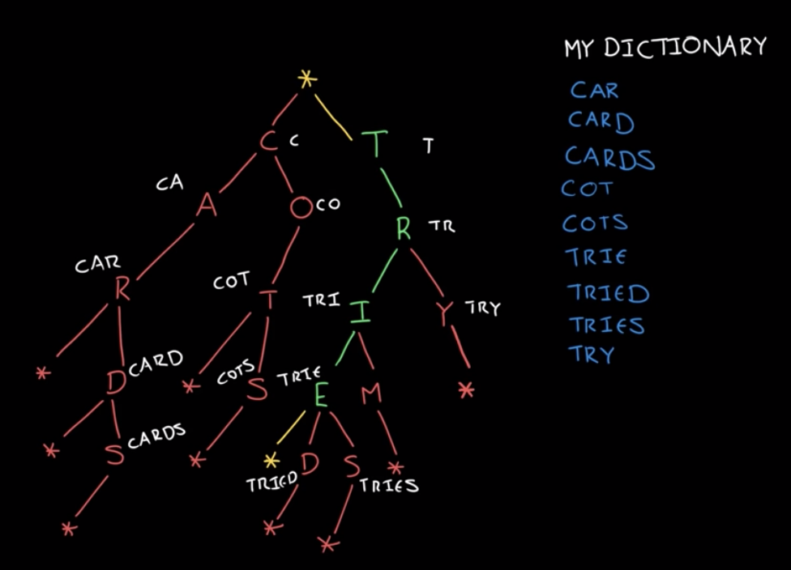

Table of Contents
- [Reference](#Reference)
  - [Complexity](#Complexity)
  - [Leetcode](#Leetcode)
    - [Classification](#Classification)
  - [Codeforces](#Codeforces)
  - [Interviewbit](#Interviewbit)
  - [Cracking the coding interview](#Cracking-the-coding-interview)
- [FAQ](#FAQ)
- [Walking through a Problem](#Walking-through-a-Problem)
- [Optimize & Solve Technique](#Optimize--Solve-Technique)
- [Math](#Math)
  - [Sum](#Sum)
- [Data Structures](#Data-Structures)
  - [String](#String)
  - [Array](#Array)
  - [Matrix](#Matrix)
  - [Linked List](#Linked-List)
  - [Stack](#Stack)
  - [Queue](#Queue)
  - [Hash Table](#Hash-Table)
  - [Cache](#Cache)
    - [LRU Cache](#LRU-Cache)
  - [Tree](#Tree)
    - [Time complexity](#Time-complexity)
    - [Binary Tree](#Binary-Tree)
    - [Binary Heaps (Min-Heaps and Max-Heaps)](#Binary-Heaps-Min-Heaps-and-Max-Heaps)
    - [Tries (Prefix Trees)](#Tries-Prefix-Trees)
    - [AVL Tree](#AVL-Tree)
    - [Red-Black Tree](#Red-Black-Tree)
    - [B Tree](#B-Tree)
  - [Graph](#Graph)
    - [Represent](#Represent)
    - [Search](#Search)
- [Algorithms](#Algorithms)
  - [Search](#Search-1)
    - [Time Complexity](#Time-Complexity)
    - [Implementation](#Implementation)
  - [Sort](#Sort)
    - [Time Complexity](#Time-Complexity-1)
    - [Implementation](#Implementation-1)
    - [Quick Sort](#Quick-Sort)
    - [Merge Sort](#Merge-Sort)
    - [Insertion Sort](#Insertion-Sort)
    - [Selection Sort](#Selection-Sort)
    - [Bubble Sort](#Bubble-Sort)
  - [Backtracking](#Backtracking)
  - [Dynamic Programming](#Dynamic-Programming)
    - [Recursion and Dynamic Programming](#Recursion-and-Dynamic-Programming)
    - [Dynamic Programming & Memorization](#Dynamic-Programming--Memorization)
  - [Greddy](#Greddy)
  - [Topoligical Sort](#Topoligical-Sort)
- [Others](#Others)
  - [Bit Mamipulation](#Bit-Mamipulation)


## Reference
### Complexity
  * [bigocheatsheet](http://bigocheatsheet.com/)
### [Leetcode](https://leetcode.com/)
#### [Classification](https://cspiration.com/leetcodeClassification#103)
### [Codeforces](https://codeforces.com/)
  * If you can achieve **1800 scores within 1 hour** that would be highly recommended for Google applicants.
### [Interviewbit](https://www.interviewbit.com/courses/programming/)
  * Level1:
    * Time Complexity
  * Level2:
    * Arrays
    * Math
  * Level3:
    * Binary Search
    * Strings
    * Bit Manipulation
    * Two Pointers
  * Level4:
    * Linked Lists
    * Stack and Queues
  * Level5:
    * Backtracking
    * Hashing
  * Level6:
    * Heaps And Maps
    * Tree
  * Level7:
    * Dynamic Programming
    * Greedy Algorithm
  * Level8
    * Graph Data Structure & Algorithms
### [Cracking the coding interview](http://www.crackingthecodinginterview.com/)


## FAQ
  * [What is tail recursion?](https://stackoverflow.com/questions/33923/what-is-tail-recursion)

## [Walking through a Problem](http://www.crackingthecodinginterview.com/resources.html)
  1. Listen Carefully
     * For example:
       * Given two arrays that are **sorted** ...
  2. Draw an Example
     * **There'a an art to drawing an example though**.
     * Most examples are too small or are special cases.
  3. State a Brute Force
     * Even if it's obvious for you, it's not ncecessarily obvious for all candidates. You don't want your interviewer to think you're struggling to see even the wasy solution.
  4. Optimize
     * Look for any **unused information**.
     * Use a fresh example
     * Solve it "incorrectly"
     * Make **time vs. space** tradeoff
     * **Precompute** information
       * Is there a way that you can reorganize the data (sortig, etc.)
     * Use a **hash table**
     * Thank about the best conceivable runtime
  5. Walk Through
     * Whiteboard coding is **slow**, you need to make sure that you get is as close to "perfect" in the beginning as possible.
  6. Implement
     * Modularized code
     * Error checks
       * A good compromise here is to add a todo and then just explain out loud what you'd like to test
     * Use other classes/structs where appropriate
     * Good variable names
  7. Test
     * Conceptual test
       * Does the code do what you think it should do?
     * Weird looking code
       * Doulbe check that line of code that says x = length -2.
     * Hot spots
       * Like base cases in recursive code. Integer division. Null nodes in binary tree.
     * Small test cases
     * Special cases
       * null of single element values.

## [Optimize & Solve Technique](http://www.crackingthecodinginterview.com/resources.html)
1. Look for **BUD**
   * **B**ottlenecks *
    * For example, suppose you have a two-step algorithm where you first sort the array and then you find elements with a particular property.
      * The first step is O(nlong(n)) and the second step if O(n).
      * Perhaps you could reduce the second step to O(1), but would it matter? Not too much as o(nlong(n)) is the bottleneck
   * **U**nnecessary work
   * **D**uplicated work
2. Do it yourself
3. **Simplify and Generalize** *
   * First, we simplify or tweak some constraint, such as the data type. Then we solve this new simplified version of the problem. Finally, once we have an algorithm for the simplified problem, we try to adapt it for the more complex version.
4. **Base case and Build** **
   * Solve the problem first for a base case (e.g., n=1) and then try to build up from there. **When we get to more complex cases (often n=3 or n=4), we try to build those using the prior solution**.
5. Data Structure Brainstorm **
   * Try to run through a list of data structures and try to apply each one.
6. **Best Conceivable Runtime** (BCR)
   * The best conceivable runtie is, literally, the **best runtime** you could conceive of a solution to a problem. You can easily prove that there is no way you could beat the BCR.

## Math

### Sum
  * Two Sum (E)
    * Use hash table
  * 3Sum (M)
  * 4Sum (M)


## [Data Structures](https://github.com/kissofjudase23/Library-python-common-modules/tree/master/common/ds)

### String
  * LeetCode:
    * **Techiniques**
    * 344: Reverse String (E)
    * 161: One Edit Distance (M)
      * Time O(1), Space (1):
        * Merge the insert and remove cases
          * Use short and long string pointers
### Array
  * LeetCode:
    *  **Techiniques**
    * Remove
      * 27: Remove elements (E)
        * The concept is like partition step in quick sort
      * 26: Remove Duplicates from Sorted Array (E)
      * 80: Remove Duplicates from Sorted Array II (M)
        * Need a counter
    * 277: [Find the Celebrity](https://pandaforme.github.io/2016/12/09/Celebrity-Problem/) (M) *
      1. Find a **celebrity candidate** having **max number** of unknown people
      2. Check if the candidate is the celebrity
         * Check the people before the celebrity candidate:
            * The celebrity does not know them but they know the celebrity.
         * Check the people after the celebrity candidate:
           * They should know the celebrity
       * Solution

          ````python
          # Return True if a knows b
          def knows(a,  b)

          def findCelebrity(self, n):
              """
              :type n: int
              :rtype: int
              """
              unknown = -1
              celebrity = 0
              for p in range(1, n):
                  if not knows(celebrity, p):
                      continue
                  celebrity = p

              for p in range(celebrity):
                  if knows(p, celebrity) and not knows(celebrity, p):
                      continue
                  return unknown

              for p in range(celebrity+1, n):
                  if knows(p, celebrity):
                      continue
                  return unknown

              return celebrity
          ````
    * 189: Rotate Array (E)
      * Space Complexity **O(1)**
        * use **three reverse** operations
    * 41: First missing positive (H) *
      * [concept](https://leetcode.com/problems/first-missing-positive/discuss/17073/Share-my-O(n)-time-O(1)-space-solution):
        * The idea is **for any k positive numbers (duplicates allowed), the first missing positive number must be within [0,k]**.
          * The reason is **like you put k balls into k+1 bins**, there must be a bin empty, the empty bin can be viewed as the missing number**.
      * [Time:O(n), Space:O(1)](https://leetcode.com/problems/first-missing-positive/discuss/17071/My-short-c%2B%2B-solution-O(1)-space-and-O(n)-time) *
         1. Each number will be put in its right place at most once after first loop *
         2. Traverse the array to find the unmatch number
         * Solution

            ```python
            def firstMissingPositive(self, nums: List[int]) -> int:
              length = len(nums)

              for i in range(length):
                  # We visit each number once, and each number will
                  # be put in its right place at most once
                  while 0 < nums[i] <= length and nums[nums[i]-1] != nums[i]:
                      # the correct position of nums[i] is in
                      # nums[nums[i]#-1]
                      correct = nums[i]-1  # need this correct
                      nums[i], nums[correct] = nums[correct] , nums[i]

              for i in range(length):
                  if nums[i] != i+1:
                      return i+1

              return length+1
            ```
      * Time O(n), Space O(n)
        * The same concept, but use extra space to keep the sorted positve numbers
        * Solution

          ```python
          def firstMissingPositive(self, nums: List[int]) -> int:

          length = len(nums)
          sorted_positive_nums = [None] * length

          for i in range(length):
              if 0 < nums[i] <= length:
                  # the correct position of nums[i] is in nums[nums[i]-1]
                  correct = nums[i]-1  # need this correct
                  sorted_positive_nums[correct] = nums[i]

          for i in range(length):
              if sorted_positive_nums[i] != i+1:
                  return i+1

          return length+1
          ```
    * 299: Bulls and Cows (M)
      * Time O(n), Space O(n) and **one pass**
        * Use **hash Table**
    * 134: Gas Station (M) **
        * **if sum of gas is more than sum of cost, then there must be a solution**.
           And the question guaranteed that the solution is unique
           (The first one I found is the right one).
        * **The tank should never be negative**, so restart whenever there is a negative number.

          ```python
          not_found = -1
          for i in range(len(gas)):
              sum_gas += gas[i]
              sum_cost += cost[i]

              tank += gas[i] - cost[i]

              # try another start
              if tank < 0:
                  start = i+1
                  tank = 0

          return start if sum_gas >= sum_cost else not_found
          ```
    * 11: Container With Most Water (M)
      * Time O(n)
        * [Use two pointer approach](https://leetcode.com/problems/container-with-most-water/) *
        * One pointer start at index 0, another start at index length-1.
    * Jump Game:
      * 55: Jump Game (M)
        * [Solution](https://leetcode.com/problems/jump-game/solution/)
        * Dynamic Programming
          * We call a position in the array a "good index" if starting at that position, we can reach the last index. Otherwise, that index is called a "bad index".
             ```python
             class Status(object):
                UNKNOWN = 1
                GOOD = 2
                BAD = 3
             ```
          * Top Down Approach
            * Time: O(n^2), Space: O(n)
              ```python
                  def canJump(self, nums: List[int]) -> bool:

                  length = len(nums)
                  memo = [Status.UNKNOWN] * length
                  memo[length-1] = Status.GOOD

                  def can_jump_from_position(nums: List[int], start: int):

                      if memo[start] is not Status.UNKNOWN:
                          return True if memo[start] is Status.GOOD else False

                      max_jump = min(length-1, start + nums[start])

                      for jump in range(start+1, max_jump+1):
                          if can_jump_from_position(nums, start=jump):
                              memo[jump] = Status.GOOD
                              return True

                      memo[jump] = Status.BAD
                      return False

                  return can_jump_from_position(nums, start=0)
              ```
          * Buttom Up Approach
            * Time: O(n^2), Space: O(n)
              ```python
                  def canJump(self, nums: List[int]) -> bool:
                    length = len(nums)
                    memo = [Status.UNKNOWN] * length
                    memo[length-1] = Status.GOOD

                    # start from length-2 to 0
                    for start in range(length-2, 0, -1):
                        max_jump = min(length-1, start+nums[start])

                        # jump from start + 1 to max_jump
                        for jump in range(start+1, max_jump+1):
                            if memo[jump] == Status.GOOD:
                                memo[jump] = Status.GOOD
                                break

                    return memo[0] == Status.GOOD
              ```

        * Greedy
          * Time: O(n), Space: O(1)
          * **The main concept is to keep the left most good index**
            * If we can reach a GOOD index, then our position is itself GOOD. Also, this new GOOD position will be the new leftmost GOOD index.
            ```python
                def canJump(self, nums: List[int]) -> bool:
                  length = len(nums)
                  last_good_index = length - 1

                  for start in range(length-1, -1, -1):
                    max_jump = nums[start]
                    if start + max_jump >= last_good_index:
                        last_good_index = start

                return last_good_index == 0
            ```
      * 45: Jump Game II (H) *
        * [Greedy](https://leetcode.com/problems/jump-game-ii/discuss/18014/Concise-O(n)-one-loop-JAVA-solution-based-on-Greedy)
          *  cur == cur_end means you visited all the items on the current level
          *  Incrementing jumps+=1 is like incrementing the level you are on.
          *  And cur_end = cur_farthest is like getting the queue size (level size) for the next level you are traversing.
            ```python
            def jump(self, nums: List[int]) -> int:
              cur_farthest = jump = cur_end = 0

              for cur in range(0, len(nums)-1):
                  cur_farthest = max(cur_farthest, cur+nums[cur])

                  if cur == cur_end:
                      jump +=1
                      cur_end = cur_farthest

              return jump
            ```
    * H-Index
      * 274. H-Index (M)
        * Time O(n), Space O(n)
          * Concept
            * **The max index in the array would be len(array)**, that is we can restrict the number of the buckets.
          * Use Hash table to accumulate the cnt of citations

            ```python
            for index, val in enumerate(citations):
              if val >= max_cita:
                  d[max_cita] += 1
              else:
                  d[val] += 1
            ```
        * Time: O(nlog(n)), Space: O(1)
          * Sort the citations array in descending order(draw it).
          * After sorting, if citations [i] citations[i]>i, then papers 0 to i all have at least i+1 citations.
    * Best Time to Buy and Sell Stock
      * [General solution](https://leetcode.com/problems/best-time-to-buy-and-sell-stock-with-transaction-fee/discuss/108870/Most-consistent-ways-of-dealing-with-the-series-of-stock-problems)
      * 121: Best Time to Buy and Sell Stock (E)
        * 1 transaction only.
        * Keep the minimum of buy price and update best sell prcie.
      * 122: Best Time to Buy and Sell Stock II (E)
        * Multiple transcation allowed.
        * [**Peak Valley** Approach](https://leetcode.com/problems/best-time-to-buy-and-sell-stock-ii/solution/)
          * solution1
             ```python
             valley = peak = prices[0];
             maxprofit = 0
             while i < len(prices) - 1:
                # find the valley
                while i < len(prices) - 1 and price[i] >= prices[i+1]:
                    i += 1
                valley = prices[i]

                while i < len(prices) - 1 and price[i] <= prices[i+1]:
                    i += 1
                peak = prices[i]

                maxprofit += (peak - valley);
             ```
          * solution2
            ```python
            maxprofit = 0
            for i in range(1, len(prices)):
                if prices[i] > price[i-1]:
                    maxprofit += prices[i] - price[i-1]
            ```
      * 714: [Best Time to Buy and Sell Stock with Transaction Fee](https://leetcode.com/problems/best-time-to-buy-and-sell-stock-with-transaction-fee/solution/) (M)
        * Cash(i):
          * The cash in hand, if you are **not holding the stock** at the end of day(i):
            * case1: cash[i] = cash[i-1]
            * case2: cash[i] = hold[i-1] + prcie[i] - fee
            * max(case1, case2) = max(cash[i-1], hold[i-1] + prcie[i] - fee)
        * Hold(i):
          * The cash in hand, if you are **holding the stock** at the end of day(i):
            * case1: hold[i] = hold[i-1]
            * case2: hold[i] = **hold[i-1] + price[i] - fee** - price[i]
            * case3: hold[i] = **cash[i-1]** - price[i]
            * max[case1, case2, case3] = max[hold[i-1], cash[i]-price[i]]
              * case2 and case3 can be reduced to cash[i] - price[i]

            ```python
            def maxProfit(self, prices: List[int], fee: int) -> int:
              cash = 0
              hold = -prices[0]
              for i in range(1, len(prices)):
                  cash = max(cash, hold+prices[i]-fee)
                  hold = max(hold, cash-prices[i])
              return cash
            ```
    * Duplicate
      * 217: Contains Duplicate (E)
        * Use hash Table
      * 219: Contains Duplicate II (E)
        * Use hash Table
    * Shortest Word Distance **
      *  243. Shortest Word Distance (E) *
         *  Keep the shortest distance in each round.
      * 245. Shortest Word Distance III (M) *
        * Allow **duplicated** words
        * Keep the shortest distance in each round.

            ```python
            for index, word in enumerate(words):

              if word == word1:
                  if same:
                      index1, index2 = index2, index
                  else:
                      index1 = index

              elif word == word2:
                  index2 = index

              if index1 != -1 and index2 != -1:
                  dist = min(dist, abs(index1-index2))
            ```

      *  244. Shortest Word Distance II (M) **
         * Init once and search multiple time.
         * Using **Preprocessed Sorted Indices** and two pointers to traverse
           * Space: O(n)
             * For or the dictionary that we prepare in the constructor.
               * The keys represent all the unique words in the input and the values represent all of the indices from 0 ... N0...N.
           * Time:
             * Init O(n)
             * Shortest O(max(K,L))
               * where K and L represent the number of occurrences of the two words.
           * code snippet for shortest operation

              ```python
              i = j = 0
              while i < len(list1) and j < len(list2):

                index1, index2 = list1[i], list2[j]

                if index1 < index2:
                    dist = min(dist, index2-index1)
                    i +=1

                else: # index2 < index1
                    dist = min(dist, index1-index2)
                    j += 1
              ```
    * Interval
      * 252. Meeting Rooms (E)
      * 253. Meeting Rooms II (M)
    * Counter
      * 53: Maximum Subarray (E)
        * [**Kadane's Algorithm**](https://leetcode.com/problems/maximum-subarray/discuss/20211/Accepted-O(n)-solution-in-java) *
    * Sort
      * 88: Merge Sorted Array
        * You may assume that nums1 has enough space (size that is greater or equal to m + n) to hold additional elements from nums2.
        * [Space Complexity O(1)](https://leetcode.com/problems/merge-sorted-array/discuss/29755/Python-easy-to-follow-solution.): *
          * Fill the arrary **from the end to the start**
### Matrix

### Linked List
* [Implementation](https://github.com/kissofjudase23/Library-python-common-modules/blob/master/common/ds/linkedlist.py)
* Time complexity
  * Average and Worst

    |                              | Search | Push_front | Push_back | Remove Node |
    |------------------------------|--------|------------|-----------|-------------|
    | Singly Linked List with tail | O(n)   | O(1)       | O(1)      | O(n)        |
    | Doubly Linked List with tail | O(n)   | O(1)       | O(1)      | O(1)        |

* LeetCode
  * **Techiniques**:
    * The **"Runner"**
      * The runner techinique means that you iterate through the linked list with **two pointers** simultaneously, with one head of the other.
    * The **"dummy node"**
      * **dummy.next** alwasy point to the head node, it very useful if the head node in the list will be changed.
    * **Use reverse instead of stack for space complexity** reduction.
      * However, reverse will change the data of the input, use it carefully.

  * **Circle**
    * 141: Linked List **Cycle** (E)
      * Using the **"Runner"** Techinique
    * 142: Linked List Cycle II (M) *
      * Given a linked list, return the node **where the cycle begins**. If there is no cycle, return null.
      * Using the **"Runner"** Techinique

   * **Remove**
     * 237: Delete Node in a Linked List (E)
     * 19: Remove Nth Node From End of List (M)
       * Using the **"Runner"** and **"dummy node"** Techiniques.
     * 203: Remove Linked List Elements (E)
       * Using the **"dummy node"** Techiniques.
     * 83: Remove Duplicates from Sorted List (M)
     * 82: Remove Duplicates from Sorted List II (M) *
       * Using the **"dummy node"** Techinique
       * Need **should_delete** flag and prev pointer

  * **Reorder**
    * 206: Reverse Linked List (E)
    * 92: Reverse Linked List II (M) *
      * From **position m to n**. Do it in **one-pass**.
      * Using **"dummy node"**.
    * 25: Reverse Nodes in k-Group (H) *
      * Enhancement of 92.
    * Swap Nodes in Pair (M) *
      * Using the **"dymmy node"** Techinique.
      * Use 3 pointers, prev ,current and next.
    * 328: Odd Even Linked List (M)
      * Create **two linked lists** and **merge** them.
    * 143: Reorder List(M) *
      * Space O(1): *
        1. Using the **"Runner"** Techinique to seprate first half and second half of the linked list.
        2. **Reverse the second half** of the linked list.
        3. Combine the first half and second half by iterative through out the second half linked list.
      * Space: O(n):
        * Use a stack to store last half of the linked list.
    * 148: Sort list **
      * Time: O(nlog(n), Space:O(1)
        * Use the **merge sort** (iterative version)
          * **Split** the linked with window size 1,2,4,8, etc.
          * **Merge** the splitted linked lists.
            * Having to handle **linking issue** between two sorted lists **after merging**.
    * 61: Rotate list
      * The rotate length k may be greater than the length of linked list

  * 2: Add Two Numbers (M)
    * Time complexity O(n) and one pass
      * don't forget the **last carry**. *
  * 160	Intersection of Two Linked Lists (E)
    * Use **difference** of length
  * 21: Merge Two Sorted Lists (E)
    * The concept is like merge step in the **merge sort**.
  * 234: Palindrome Linked List(M)
    * Space Complexity O(1) *:
      * Reverse first half of the linked list, but it is not a pratical solution since we should not modity the constant function of the input.
    * Space Complexity O(n):
      * Use a stack
  * 369	[Plus One Linked List](https://www.geeksforgeeks.org/add-1-number-represented-linked-list/)
    1. **Reverse** given linked list. For example, 1-> 9-> 9 -> 9 is converted to 9-> 9 -> 9 ->1.
    2. Start traversing linked list from leftmost node and add 1 to it. If there is a carry, move to the next node. Keep moving to the next node while there is a carry.
    3. **Reverse** modified linked list and return head.
  * TODO
    * 86	Partition List
    * 23	Merge k Sorted Lists
    * 147	Insertion Sort List

### Stack
* [Implementation](https://github.com/kissofjudase23/Library-python-common-modules/blob/master/common/ds/stack.py)
* Time complexity
  * Average and Worst

      |       | Push | Pop  | Search|
      |-------|------|------|-------|
      | Stack | O(1) | O(1) | O(n)  |

* LeetCode
  * 155. Min Stack (E)
    * Space (n)
      * Use extra space to keep minimum

### Queue
* [Implementation](https://github.com/kissofjudase23/Library-python-common-modules/blob/master/common/ds/queue.py)
* Time complexity
  * Average and Worst

    |       | Add  | Remove  | Search|
    |-------|------|---------|-------|
    | Queue | O(1) | O(1)    | O(n)  |


### Hash Table
* Time complexity
  * Average

    |            | Set  | Get  | Delete |
    |------------|------|------|--------|
    | Hash Table | O(1) | O(1) | O(1)   |

  * Worst

    |            | Set  | Get  | Delete |
    |------------|------|------|--------|
    | Hash Table | O(n) | O(n) | O(n)   |


### Cache
#### LRU Cache
* 
* [Implementation](https://github.com/kissofjudase23/Library-python-common-modules/blob/master/common/ds/cache.py)
* Time complexity
  * Use **Doubly linked List** as underlying data structure for O(1) node remove operation
  * Use **hash table** for O(1) lookup
  * Doubly Linked List + Hash Table

    |            | Set  | Get  | Delete |
    |------------|------|------|--------|
    | LRU Cache  | O(1) | O(1) | O(1)   |

* LeetCode
  * [146, LRU Cache](https://leetcode.com/problems/lru-cache/) (M)

### Tree
#### Time complexity
  * Average

    |                    | Access     | Search     | Insertion  | Deletion   |
    |--------------------|------------|------------|------------|------------|
    | Binary Search Tree | O(long(n)) | O(long(n)) | O(long(n)) | O(long(n)) |
    | AVL Tree           | O(long(n)) | O(long(n)) | O(long(n)) | O(long(n)) |
    | B Tree             | O(long(n)) | O(long(n)) | O(long(n)) | O(long(n)) |
    | Red-Black Tree     | O(long(n)) | O(long(n)) | O(long(n)) | O(long(n)) |

  * Worst

    |                    | Access     | Search     | Insertion  | Deletion   |
    |--------------------|------------|------------|------------|------------|
    | Binary Search Tree | O(n)       | O(n)       | O(n)       | O(n)       |
    | AVL Tree           | O(long(n)) | O(long(n)) | O(long(n)) | O(long(n)) |
    | B Tree             | O(long(n)) | O(long(n)) | O(long(n)) | O(long(n)) |
    | Red-Black Tree     | O(long(n)) | O(long(n)) | O(long(n)) | O(long(n)) |

#### Binary Tree
* Types
  * Binary search Trees:
    * **All left descendents <= n < all right descendents**
  * Complete Binary Trees
    * A binary tree in which every level of the tree is **fully filled**, except the rightmost element on the last level.
  * Full Binary Trees
    * A binary tree in which every node has **either zero of two children**.
  * Perfect Binary Trees
    * A binary tree is one that **full and complete**.
    * All leaf nodes will be at the same level, and this level has the maximum number of nodes.

* Traversal
  * In-Order
    * recursive

        ```python
        def in_order_traversal(node):

          if not node:
            return

          in_order_traversal(node.left)
          visit(node)
          in_order_traversal(node.right)
        ```
    * iterative

        ```python
        def in_order_traversal(node):

          current = node
          stack = list()

          while current or stack:

            if current:
              stack.append(current)
              current = current.left

            else:
              node = stack.pop()
              visit(node)
              current = current.right

        ```
  * Pre-Order
    * recursive

      ```python
        def pre_order_traversal(node):

          if not node:
            return

          visit(node)
          pre_order_traversal(node.left)
          pre_order_traversal(node.right)
      ```
    * iterative

      ```python
        def pre_order_traversal(node):

          if not node:
            return

          current = node
          stack = list()

          while current or stack:
            if not current:
              current = stack.pop()

            visit(current)
            if current.right
              stack.append(current.right)
            current = current.left


      ```
  * Post-Order
    * recursive

      ```python
        def post_order_traversal(node):

          if not node:
            return

          post_order_traversal(node.left)
          post_order_traversal(node.right)
          visit(node)
      ```

    * iterative

      ```python
        def post_order_traversal(node):

          if not node:
            return

          s1 , s2 = list(), list()
          stack.append(node)

          while s1:
            node = s1.pop()
            if node.left:
              s1.append(node.left)

            if node.right:
              s1.append(node.right)

          while s2:
            node = s2.pop()
            visit(node)
      ```

* LeetCode
  * 144: Binary Tree **Preorder** Traversal (M)
    * Use **one stack** for iterative method
  * 94: Binary Tree **Inorder** Traversal (M)
    * Use **one stack** for iterative method
  * 145: Binary Tree **Postorder** Traversal (H)
    * Use **two stacks** for iterative method
  * 102: Binary **Tree Level** Order Traversal (M) *
    * Use **the length of the queue** for each round
  * 173. Binary Search Tree Iterator (M) *
    * Use the concept of inorder Traversal


#### Binary Heaps (Min-Heaps and Max-Heaps)
* Ref:
  * https://towardsdatascience.com/data-structure-heap-23d4c78a6962
* **complete binary tree**
* Min-Heaps
  * Ascencding order
* Max-Heaps
  * Descending Order
* Insert
  * **bubble up** Operation which takes **O(log(n))**
  * Insert at the **rightmost spot so as to maintain the complete binary tree**.
  * **Fix the tree by swapping the new element with parents**, until finding the appropriate spot.
* Extract minimum (maximum) elements
  * **bubble down** which takes **O(log(n))**
  * Remove the mimimum element and swap it with the last element in the heap.
  * Bubble down this element, swapping it with one of its children until the min-heap property is restored.

#### Tries (Prefix Trees)
* Ref:
  * https://leetcode.com/articles/implement-trie-prefix-tree/
  * https://www.youtube.com/watch?v=AXjmTQ8LEoI
  * https://www.youtube.com/watch?v=zIjfhVPRZCg

* A trie is a variant of an n-ary tree in which characters are stored at each node. Each path down the tree may represent a word.
* Used to store collections of words.
  * If 2 words have a common prefix then they will have the same ancesctors in this trie.
  * abcl
  * abgd
  * 

* [Implementation](https://github.com/kissofjudase23/Library-python-common-modules/blob/master/common/ds/trie.py)
  ```python
    class TrieNode(object):
      def __init__(self):
          self.children = dict()
          self.end_of_word = False
  ```
* Use cases:
  * **Prefix** lookups.
  * **Whole word** lookups.
  * Autocomplete
  * Spell checker

* FAQ
  * Compare with Hash Table
    * While a hash table can quickly loop up whether a string is a valid word, **it cannot tell us if a string is a prefix of any words**.
    * A trie can check if a string is a valid prefix in O(k), where k is the length of the string. Although we often refer to hash table loopups as being O(1) time, this isn't entirely true. **A hash table must read though all the characters in the input**, which takes **O(k)** time in the case of a word lookup.

* LeetCode
  * [208: Implement Trie (Prefix Tree)](https://leetcode.com/problems/implement-trie-prefix-tree/)
    * medium
    * serach word and search prefix
  * [211: Add and Search Word - Data structure design](https://leetcode.com/problems/add-and-search-word-data-structure-design/)
    * medium
    * search word (support wildcard)
      * For iterative methods
        * Use **stack** for traversal, and **use continue instead of return false when not found**.
  * 212: Word Search II
    * hard


#### AVL Tree
* Balanced Tree

#### Red-Black Tree
* Balanced Tree

#### B Tree
* Balanced Tree

### Graph
#### Represent
  * Adjacency List
  * Adjacency Matrices
#### Search
  * Depth-First Search (DFS)
  * Breadth-First Search (BFS)


## Algorithms
### Search
#### Time Complexity

  |                  | Average     | Worst      | Space Worst |
  |------------------|-------------|------------|-------------|
  | Binary Search (I)| O(long(n))  | O(long(n)) | O(1)        |
  | Binary Search (R)| O(long(n))  | O(long(n)) | O(long(n))  |


#### [Implementation](https://github.com/kissofjudase23/Library-python-common-modules/blob/master/common/algo/search.py)

### Sort
#### Time Complexity

  |                | Best       | Average    | Worst      | Space Complexity | Stable/Unstable |
  |----------------|------------|------------|------------|------------------|-----------------|
  | Quick Sort     | O(nlog(n)  | O(nlog(n)  | O(n^2)     | O(log(n))        | Unstable        |
  | Merge Sort     | O(nlog(n)  | O(nlog(n)  | O(nlog(n)  | O(n)             | Stable          |
  | Heap Sort      | O(nlog(n)  | O(nlog(n)  | O(nlog(n)  | O(1)             | Unstable        |
  | Insertion Sort | O(n)       | O(n^2)     | O(n^2)     | O(1)             | Stable          |
  | Selection Sort | O(n^2)     | O(n^2)     | O(n^2)     | O(1)             | Unstable        |
  | Bubble Sort    | O(n)       | O(n^2)     | O(n^2)     | O(1)             | Stable          |
  | Radix Sort     | O(d*(n+r)) | O(d*(n+r)) | O(d*(n+r)) | O(r*n)           | Stable          |

#### [Implementation](https://github.com/kissofjudase23/Library-python-common-modules/blob/master/common/algo/search.py)
#### Quick Sort
  * FAQ
    * [Why does QuickSort use O(log(n)) extra space?](https://stackoverflow.com/questions/12573330/why-does-quicksort-use-ologn-extra-space)
      * To get rid of the recursive call you would have to use **a stack** in your code, and it would still occupy **log(n)** space.
    * [Quick sort implement by queue?](https://stackoverflow.com/questions/39666714/quick-sort-implement-by-queue)
      * Queue method requires O(n) space for sorting an array of size n.
  * Worst Case:
    * [1, 2, 3, 4, 5]
      * round1:
        * pivot: 5
        * left partition [1, 2, 3, 4]
        * right partition []
      * round2:
        * pivot: 4
        * left partition [1, 2, 3]
        * right partition []
      * ...
    * Solution:
      * Use median of three to pick pivot

    * T(n) = T(n-1) + cn

  * Unstable Case:
    * [quicksort algorithm stability](https://stackoverflow.com/questions/13498213/quicksort-algorithm-stability)
    * [4, 2, 1 ,4*, 3]
      * round1:
        * partition:
          * pivot: 3
          * [2, 1, 3 ,4*, 4]
  * Recursive
    * https://www.geeksforgeeks.org/python-program-for-quicksort/
    * https://www.youtube.com/watch?v=CB_NCoxzQnk

  * Iterative
    * https://www.techiedelight.com/iterative-implementation-of-quicksort/

#### Merge Sort
  * Ref
    * https://www.geeksforgeeks.org/merge-sort/
    * https://www.youtube.com/watch?v=6pV2IF0fgKY

  * Recursive:
    * 
  * Iterative:
    * 

#### Insertion Sort
  * Best Case: ascending sequence, [1, 2, 3]
  * Worst Case: descending sequence, [3, 2, 1]
#### Selection Sort
  * Unstable: [5, 5*, 3]
#### Bubble Sort
  * Best Case:
    * ascending sequence, [1, 2, 3]
    * (n-1) comparison in round1, and no swap happened.
  * Worst Case:
    * descending sequence, [3, 2, 1]

### Backtracking


### Dynamic Programming
#### Recursion and Dynamic Programming
   * Recursive
     * By definition, are built of solutions to subproblems.
     * **Bottom-Up** Approach
       * It often the most intuitive.
     * **Top-Down** Approach
       * The top-down solution can be more complex since it's less concrete.
     * **Half-and-Half** Approach
       * Like merge sort and binary search
     * Recursive vs. Iteration Solutions
       * Recursive algorithms can be very **space inefficient**. Each recursive call adds a new layer to the stack.
       * For this reason, it's often better to implement a recurisve algorithm iteratively.

#### Dynamic Programming & Memorization
  * Dynamic Programming is mostly just a matter of taking a **recursive algorithm** and **finding the overlapping subproblems**. You then cache those results for future recursive calls.
  * Example:
    * resursive: O(n^2), O(n)

      ```python
      def fib(i):
        if i == 0 or i == 1:
            return i

        return fib(i-1) + fib(i-2)
      ```
    * Iterative: O(n), O(1)

      ```python
      def fib(i):
         if i == 0 or i == 1:
            return i

          a, b = 0, 1
          for _ in range(2, i+1):
            a, b = b, a + b

          return a

      ```
    * **Top-Down** Dynamic Programming (or Memoization): O(n), O(n)

      ```python
      def fib(i):

        memo = dict()

        def _fib(i):
          if i == 0 or i == 1:
            return i

          if i not in memo:
            memo[i] = _fib(i-1), _fib(i-2)

          return memo[i]

        return _fib(i)

      ```
    * **Bottom-Up** Dynamic Programming: O(n), O(n)

      ```python
      def fib(i):

        if i == 0 or i == 1:
            return i

        memo = dict()
        memo[0] = 0
        memo[1] = 1

        for f in range(2, i+1):
          memo[f] = memo[f-1] + memo[f-2]

        return memo[i]
      ```

### Greddy


### Topoligical Sort

## Others
### Bit Mamipulation
