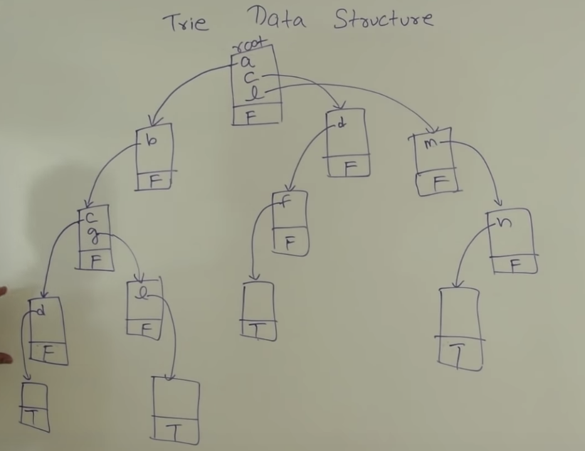

Table of Contents
- [Reference](#Reference)
  - [Complexity](#Complexity)
  - [Leetcode](#Leetcode)
    - [Classification](#Classification)
  - [Codeforces](#Codeforces)
  - [Interviewbit](#Interviewbit)
  - [Cracking the coding interview](#Cracking-the-coding-interview)
- [FAQ](#FAQ)
- [Walking through a Problem](#Walking-through-a-Problem)
- [Optimize & Solve Technique](#Optimize--Solve-Technique)
- [Math](#Math)
  - [Sum](#Sum)
- [Data Structures](#Data-Structures)
  - [String](#String)
  - [Array](#Array)
  - [Matrix](#Matrix)
  - [Linked List](#Linked-List)
  - [Stack](#Stack)
  - [Queue](#Queue)
  - [Hash Table](#Hash-Table)
  - [Cache](#Cache)
    - [LRU Cache](#LRU-Cache)
  - [Tree](#Tree)
    - [Time complexity](#Time-complexity)
    - [Binary Tree](#Binary-Tree)
    - [Binary Heaps (Min-Heaps and Max-Heaps)](#Binary-Heaps-Min-Heaps-and-Max-Heaps)
    - [Tries (Prefix Trees)](#Tries-Prefix-Trees)
    - [AVL Tree](#AVL-Tree)
    - [Red-Black Tree](#Red-Black-Tree)
    - [B Tree](#B-Tree)
  - [Graph](#Graph)
    - [Represent](#Represent)
    - [Search](#Search)
- [Algorithms](#Algorithms)
  - [Search](#Search-1)
    - [Time Complexity](#Time-Complexity)
    - [Implementation](#Implementation)
  - [Sort](#Sort)
    - [Time Complexity](#Time-Complexity-1)
    - [Implementation](#Implementation-1)
    - [Quick Sort](#Quick-Sort)
    - [Merge Sort](#Merge-Sort)
    - [Insertion Sort](#Insertion-Sort)
    - [Selection Sort](#Selection-Sort)
    - [Bubble Sort](#Bubble-Sort)
    - [Heap Sort](#Heap-Sort)
  - [Backtracking](#Backtracking)
  - [Dynamic Programming](#Dynamic-Programming)
    - [Recursion and Dynamic Programming](#Recursion-and-Dynamic-Programming)
    - [Dynamic Programming & Memorization](#Dynamic-Programming--Memorization)
  - [Greddy](#Greddy)
  - [Topoligical Sort](#Topoligical-Sort)
- [Others](#Others)
  - [Bit Mamipulation](#Bit-Mamipulation)


## Reference
### Complexity
  * [bigocheatsheet](http://bigocheatsheet.com/)
### [Leetcode](https://leetcode.com/)
#### [Classification](https://cspiration.com/leetcodeClassification#103)
### [Codeforces](https://codeforces.com/)
  * If you can achieve **1800 scores within 1 hour** that would be highly recommended for Google applicants.
### [Interviewbit](https://www.interviewbit.com/courses/programming/)
  * Level1:
    * Time Complexity
  * Level2:
    * Arrays
    * Math
  * Level3:
    * Binary Search
    * Strings
    * Bit Manipulation
    * Two Pointers
  * Level4:
    * Linked Lists
    * Stack and Queues
  * Level5:
    * Backtracking
    * Hashing
  * Level6:
    * Heaps And Maps
    * Tree
  * Level7:
    * Dynamic Programming
    * Greedy Algorithm
  * Level8
    * Graph Data Structure & Algorithms
### [Cracking the coding interview](http://www.crackingthecodinginterview.com/)


## FAQ
  * [What is tail recursion?](https://stackoverflow.com/questions/33923/what-is-tail-recursion)

## [Walking through a Problem](http://www.crackingthecodinginterview.com/resources.html)
  1. Listen Carefully
     * For example:
       * Given two arrays that are **sorted** ...
  2. Draw an Example
     * **There'a an art to drawing an example though**.
     * Most examples are too small or are special cases.
  3. State a Brute Force
     * Even if it's obvious for you, it's not ncecessarily obvious for all candidates. You don't want your interviewer to think you're struggling to see even the wasy solution.
  4. Optimize
     * Look for any **unused information**.
     * Use a fresh example
     * Solve it "incorrectly"
     * Make **time vs. space** tradeoff
     * **Precompute** information
       * Is there a way that you can reorganize the data (sortig, etc.)
     * Use a **hash table**
     * Thank about the best conceivable runtime
  5. Walk Through
     * Whiteboard coding is **slow**, you need to make sure that you get is as close to "perfect" in the beginning as possible.
  6. Implement
     * Modularized code
     * Error checks
       * A good compromise here is to add a todo and then just explain out loud what you'd like to test
     * Use other classes/structs where appropriate
     * Good variable names
  7. Test
     * Conceptual test
       * Does the code do what you think it should do?
     * Weird looking code
       * Doulbe check that line of code that says x = length -2.
     * Hot spots
       * Like base cases in recursive code. Integer division. Null nodes in binary tree.
     * Small test cases
     * Special cases
       * null of single element values.

## [Optimize & Solve Technique](http://www.crackingthecodinginterview.com/resources.html)
1. Look for **BUD**
   * **B**ottlenecks *
    * For example, suppose you have a two-step algorithm where you first sort the array and then you find elements with a particular property.
      * The first step is O(nlong(n)) and the second step if O(n).
      * Perhaps you could reduce the second step to O(1), but would it matter? Not too much as o(nlong(n)) is the bottleneck
   * **U**nnecessary work
   * **D**uplicated work
2. Do it yourself
3. **Simplify and Generalize** *
   * First, we simplify or tweak some constraint, such as the data type. Then we solve this new simplified version of the problem. Finally, once we have an algorithm for the simplified problem, we try to adapt it for the more complex version.
4. **Base case and Build** **
   * Solve the problem first for a base case (e.g., n=1) and then try to build up from there. **When we get to more complex cases (often n=3 or n=4), we try to build those using the prior solution**.
5. Data Structure Brainstorm **
   * Try to run through a list of data structures and try to apply each one.
6. **Best Conceivable Runtime** (BCR)
   * The best conceivable runtie is, literally, the **best runtime** you could conceive of a solution to a problem. You can easily prove that there is no way you could beat the BCR.

## Math

### Reverse
* 7. Reverse Integer
  * Notice the boundary
  ```python
  def reverse(self, x: int) -> int:
    is_positive = True if x >=0 else False
    reverse = 0
    boundary = (2 ** 31)//10 # 2147483640

    if not is_positive:
        x = -x

    while x:
        pop = x % 10
        x //= 10
        # boundary = 214748364
        # boundary * 10 = 2147483640
        # 2**31 = 2147483648 = 2147483640 + 8 = boundary * 10 + 8
        if reverse > boundary or reverse == boundary and pop > 7 :
            return 0

        reverse = reverse * 10 + pop

    if not is_positive:
        reverse = -reverse

    return reverse
  ```
### Sum
  * 1: Two Sum (E)
    * Time: O(n), Space: O(n)
      * Use hash table
  * 15: 3Sum (M)
    * Time O(n^2)
      1. **Sort** first
      2. For each target (from 0 to n-3)
           * Find left and right pair that num[target] + num[left] + num[right] = 0
           * Target = -num[target] = num[left] + num[right]
    * Why does the algorithm work?
        * Assume that we find a correct target for num[left] + num[right]
          * case1: x
            * nums[left+1] + nums[right+1] > Target
          * case2: x
            * nums[left-1] + nums[right-1] < Target.
          * case3: ✓
            * nums[left+1] + nums[right-1] may be possible.
          * case4: x
            * nums[left-1] + nums[r+1] has been traverse before.
    * Python Solution
        ```python
        def threeSum(self, nums: List[int]) -> List[List[int]]:

          res = list()
          nums.sort()

          for i in range(0, len(nums)-2):

              # skip duplicate
              if i > 0 and nums[i] == nums[i-1]:
                  continue

              l, r = i+1, len(nums)-1

              while l < r:

                  s = nums[i] + nums[l] + nums[r]

                  if s < 0:
                      l += 1

                  elif s > 0:
                      r -= 1

                  else:
                      res.append([nums[i],nums[l],nums[r]])

                      # skip duplicate
                      while l < r and nums[l] == nums[l+1]:
                          l += 1
                      while l < r and nums[r] == nums[r-1]:
                          r -= 1

                      l+=1
                      r-=1

            return res
        ```
  * 4Sum (M)


## [Data Structures](https://github.com/kissofjudase23/Library-python-common-modules/tree/master/common/ds)

### String
  * LeetCode:
    * 387. First Unique Character in a String
      * Time: O(n), Space: O(c)
        * Use Hash Table
    * 344: Reverse String (E)
    * 58: Length of Last Word (E)
      * Seach **from the end to the beginning**.
    * 161: One Edit Distance (M)
      * Time O(1), Space (1):
        * Merge the insert and remove cases (find the short one)
        * Use short and long string pointers to traverse and compare
    * 28: Implement strStr(E)
      * Find Sub-String
      * Brute Force
        * Time: O(mn), Space(1)
      * **KMP (substring match)** ***
        * Time: O(m+n), Space: O(n),
          * where m is the length of txt stringm n is the length of the pattern string.
        * Reference:
          * [Concept](https://www.youtube.com/watch?v=GTJr8OvyEVQ)
          * [The LPS table](http://jakeboxer.com/blog/2009/12/13/the-knuth-morris-pratt-algorithm-in-my-own-words/)
            * Definiton of Proper Prefix and Suffix
              * For a pattern: "Snape"
                * The proper prefix would be
                  * S, Sn, Sna, Snap
                * The proper suffix would be
                  * nape, ape, pe, e
            * Definition of the value in prefix suffix table
              * **The length of the longest proper prefix** in the (sub)pattern that matches a proper suffix in the same (sub)pattern.
          * Example
            * 
              * When un-macth happends, **the max reusable string range for next round is in suffix range**.
              * Seach from LPS array and find the proper start position of pattern comparison pointer (in this example, index 3).
        * Python Solution
          ```python
          def get_lps(pattern):

              # init lps array
              lps = [None] * len(pattern)
              lps[0] = 0

              p = 0  # prefix pointer
              s = 1  # suffix pointer

              while s < len(pattern):
                  if pattern[s] == pattern[p]:
                      p += 1
                      lps[s] = p  # update suffix length
                      s += 1
                  else:
                      if p > 0:
                          # reuse the prefix string that has been scanned.
                          # The length of the longest common prefix suffix
                          # are put in lps[p-1]
                          p = lps[p-1]
                      else:  # p = 0
                          # do not match anything
                          lps[s] = 0
                          s += 1
              return lps

          def is_substring(txt: str, pattern: str) -> int:
              if not pattern or len(pattern) == 0:
                  return 0

              res = not_found = -1
              lps = get_lps(pattern)
              i = j = 0
              while i < len(txt):
                  if txt[i] == pattern[j]:
                      i += 1
                      j += 1
                      if j == len(pattern):
                          res =  i - j
                          break
                  else:
                      if j > 0:
                          # reuse the prefix string that has been scanned.
                          # The length of the longest common prefix suffix
                          # are put in lps[p-1]
                          j = lps[j-1]
                      else: # j = 0
                          # do not match anything
                          i += 1
              return res
          ```
        * 14: Longest Common Prefix (E)
          * Use **vertical scanning**
            * Time: O(mn)
              * Where m is the minimum length of str in strs and n is the len(strs).
            * Python Solution
                ```python
                def longest_common_prefix(self, strs: List[str]) -> str:
                  if not strs:
                      return ""

                  prefix = strs[0]
                  # Vertical Scanning
                  for i in range(0, len(prefix)):
                      c = prefix[i]
                      for j in range(1, len(strs)):
                          if i == len(strs[j]) or strs[j][i] != c:
                              prefix = prefix[:i]
                              found = True
                              break

                      if found:
                          break

                  return prefix
                ```
    * SubString
    * Palindrome
    * Parentheses
      * 20: Valid Parentheses (E)
        * Python Solution
          ```python
          BRACKET_MAP = {'(': ')', '[': ']', '{': '}'}

          def ia_valid_parentheses(self, s: str) -> bool:
              if not s:
                  return True

              ret = True
              stack = list()

              for c in s:
                  if c in BRACKET_MAP:
                      stack.append(c)
                  else:
                      if not stack or c != BRACKET_MAP[stack.pop()]:
                          return False

              return len(stack) == 0
          ```
    * Subsequence

### Array
  * LeetCode:
    * Remove
      * 27: Remove elements (E)
        * Like partition step of quick sort (keep the border)
        * Copy the wanted elements to the front of the array
      * 26: Remove Duplicates from Sorted Array (E)
      * 80: Remove Duplicates from Sorted Array II (M)
        * Need a counter
    * 277: [Find the Celebrity](https://pandaforme.github.io/2016/12/09/Celebrity-Problem/) (M) *
      1. Find the **celebrity candidate**
      2. Check if the candidate is the celebrity
         * Check the people before the celebrity candidate:
            * The celebrity does not know them but they know the celebrity.
         * Check the people after the celebrity candidate:
           * They should know the celebrity
       * Python Solution
          ````python
          # Return True if a knows b
          def knows(a,  b)

          def find_celebrity(self, n):
              """
              :type n: int
              :rtype: int
              """
              unknown = -1
              celebrity = 0
              # find the celebrity candidate
              for p in range(1, n):
                  if not knows(celebrity, p):
                      continue
                  celebrity = p

              # check people in the left side
              for p in range(celebrity):
                  if knows(p, celebrity) and not knows(celebrity, p):
                      continue
                  return unknown

              # # check people in the right side
              for p in range(celebrity+1, n):
                  if knows(p, celebrity):
                      continue
                  return unknown

              return celebrity
          ````
    * 189: Rotate Array (E)
      * Space Complexity **O(1)**
        * Use **three reverse** operations can solve this problem.
    * 41: First missing positive (H) *
      * [concept](https://leetcode.com/problems/first-missing-positive/discuss/17073/Share-my-O(n)-time-O(1)-space-solution):
          * The idea is **like you put k balls into k+1 bins**, there must be a bin empty, the empty bin can be viewed as the missing number.
      * Time O(n), Space O(n)
        * Use extra space to keep the sorted positve numbers.
        * Python Solution
          ```python
          def firstMissingPositive(self, nums: List[int]) -> int:
            length = len(nums)
            sorted_positive_nums = [None] * length

            for i in range(length):
                if 0 < nums[i] <= length:
                    # the correct position of nums[i] is in nums[nums[i]-1]
                    correct = nums[i]-1  # need this correct
                    sorted_positive_nums[correct] = nums[i]

            for i in range(length):
                if sorted_positive_nums[i] != i+1:
                    return i+1

            # not found from 0 to length-1, so the first missing is in length-th
            return length+1
          ```
      * [Time:O(n), Space:O(1)](https://leetcode.com/problems/first-missing-positive/discuss/17071/My-short-c%2B%2B-solution-O(1)-space-and-O(n)-time) *
         1. Each number will be put in its right place at most once after first loop *
         2. Traverse the array to find the unmatch number
         * Python Solution
            ```python
            def firstMissingPositive(self, nums: List[int]) -> int:
              length = len(nums)

              for i in range(length):
                  # We visit each number once, and each number will
                  # be put in its right place at most once
                  while 0 < nums[i] <= length and nums[nums[i]-1] != nums[i]:
                      # the correct position of nums[i] is in
                      # nums[nums[i]#-1]
                      correct = nums[i]-1  # need this correct
                      nums[i], nums[correct] = nums[correct] , nums[i]

              for i in range(length):
                  if nums[i] != i+1:
                      return i+1
               not found from 0 to length-1, so the first missing is in length-th
              return length+1
            ```
    * 299: Bulls and Cows (M)
      * Time O(n), Space O(n) and **one pass**
        * Use **hash Table** to count cows.
        * Python solution
          ```python
          for s,g in zip(secret, guess):
            if s == g:
                bull += 1
            else:  # s != g
                if hash_table[s] < 0:
                    # s appears in guess before
                    cow += 1
                if hash_table[g] > 0:
                    # g appears in secret before
                    cow += 1

                hash_table[s] += 1
                hash_table[g] -= 1

          return f'{bull}A{cow}B'
          ```
    * 134: Gas Station (M) **
        * **if sum of gas is more than sum of cost, then there must be a solution**.
           And the question guaranteed that the solution is unique
           (The first one I found is the right one).
        * **The tank should never be negative**, so restart whenever there is a negative number.
        * Python Solution
          ```python
          start, not_found = 0, -1

          for i in range(len(gas)):
              sum_gas += gas[i]
              sum_cost += cost[i]
              tank += gas[i] - cost[i]

              # try another start
              if tank < 0:
                  start = i+1
                  tank = 0

          return start if sum_gas >= sum_cost else not_found
          ```
    * Container
      * 11: Container With Most Water (M)
        * Time O(n)
          * Area:
            * min(left_border, right_border) * width
          * [2 pointers approach](https://leetcode.com/problems/container-with-most-water/solution/) *
            * Left pointer starts at position 0
            * Right starts at position length-1
            * Move the index with shorter height to find the bigger area.
      * 42: Trapping Rain Water (H) *
        * [Solution](https://leetcode.com/problems/trapping-rain-water/solution/)
        * How to calculate the area ?
          * Sum water amount of each bin (width=1)
            * Find left border
            * Find right border
            * Water area in the ith bin would be:
              * **min(left_border, right_border) - height of ith bin**
        * Dynamic Programming:
          * Time: O(n), Space: O(n)
          * Keep two arrays
            * left_max
              * The left_max[i] is the **left border** in ith bin.
            * right_max
              * The right_max[i] is the **right border** in ith bin.
            * Python Solution
              ```python
              def trap(self, height: List[int]) -> int:
                area = 0
                if not height:
                    return 0

                length = len(height)

                left_max = [None] * length
                right_max = [None] * length

                left_max[0] = height[0]
                right_max[length-1] = height[length-1]

                # calculate left border array
                for i in range(1, length):
                    left_max[i] = max(height[i], left_max[i-1])

                # calculate right border array
                for i in range(length-2, -1, -1):
                    right_max[i] = max(height[i], right_max[i+1])

                # sum the area for each bin
                for l_max, r_max, h in zip(left_max, right_max, height):
                    area += min(l_max, r_max) - h

                return area
              ```
          * [2 pointers approach](https://leetcode.com/problems/trapping-rain-water/solution/)
            * Concept
              * If the right border > left border, the area of ith bin is determined by the left border.
              * vice versa
              * So we fix the higher border, and move the lower border to calcualte the area
            * Time: O(n), Space: O(1)
            * Python Solution
              ```python
              def trap(self, height: List[int]) -> int:
                area = 0
                if not height:
                    return area

                left, right = 0, len(height)-1
                max_left = max_right = 0

                while left <= right:
                    # determine the border
                    # area depends on left border
                    if height[left] <= height[right]:
                        if height[left] >= max_left:
                            max_left = height[left]
                        else:
                            area += (max_left - height[left])
                        left += 1

                    # area depends on right border
                    else:
                        if height[right] > max_right:
                            max_right = height[right]
                        else:
                            area += (max_right - height[right])
                        right -= 1

                return area
              ```
    * Jump Game:
      * 55: Jump Game (M)
        * [Solution](https://leetcode.com/problems/jump-game/solution/)
        * Dynamic Programming
          * We call a position in the array a **"good index" if starting at that position, we can reach the last index.** Otherwise, that index is called a "bad index".
             ```python
             class Status(object):
                UNKNOWN = 1
                GOOD = 2
                BAD = 3
             ```
          * Top Down Approach
            * Time: O(n^2), Space: O(n)
            * Python Solution
              ```python
              def canJump(self, nums: List[int]) -> bool:
                  length = len(nums)
                  memo = [Status.UNKNOWN] * length
                  memo[length-1] = Status.GOOD

                  def _can_jump_from_position(nums: List[int], start: int):

                      if memo[start] is not Status.UNKNOWN:
                          return True if memo[start] is Status.GOOD else False

                      max_jump = min(start+nums[start], length-1)

                      # from max_jump to start + 1
                      for jump in range(max_jump ,start, -1):
                          if _can_jump_from_position(nums, start=jump):
                              memo[start] = Status.GOOD
                              return True
                      # failed
                      memo[start] = Status.BAD
                      return False

                 return _can_jump_from_position(nums, start=0)
              ```
          * Buttom Up Approach
            * Time: O(n^2), Space: O(n)
            * Python Solution
              ```python
              def canJump(self, nums: List[int]) -> bool:
                length = len(nums)
                memo = [Status.UNKNOWN] * length
                memo[length-1] = Status.GOOD

                # start from length-2 to 0
                for start in range(length-2, -1, -1):
                    max_jump = min(start+nums[start], length-1)

                    # jump from max_jump to start
                    for jump in range(max_jump, start, -1):
                        # find the first good index
                        if memo[jump] == Status.GOOD:
                            memo[start] = Status.GOOD
                            break

                return memo[0] == Status.GOOD
              ```
        * Greedy
          * Time: O(n), Space: O(1)
          * **The main concept is to keep the left most good index**
            * If we can reach a GOOD index, then our position is a GOOD index as well. and this new GOOD index will be the new leftmost GOOD index.
          * Python Solution
            ```python
            def canJump(self, nums: List[int]) -> bool:
              length = len(nums)
              left_most_good_idx = length - 1

              # from length-2 to 0
              for start in range(length-2, -1, -1):
                if start + nums[start] >= left_most_good_idx:
                    left_most_good_idx = start

              return left_most_good_idx == 0
            ```
      * 45: Jump Game II (H) *
        * [Greedy](https://leetcode.com/problems/jump-game-ii/discuss/18014/Concise-O(n)-one-loop-JAVA-solution-based-on-Greedy)
          * Find the minimum jump
          * Greedy
            * Time: O(n), Space: O(1)
            *  **cur == cur_border**
               *  means you visited all the items on the current level
               *  Incrementing jumps+=1 is like incrementing the level you are on.
            *  And **cur_end = cur_farthest** is like getting the queue size (level size) for the next level you are traversing.
          *  Python Solution
              ```python
              def jump(self, nums: List[int]) -> int:

                jump = cur_border = cur_farthest = 0

                for cur in range(0, len(nums)-1):
                    cur_farthest = max(cur_farthest, cur+nums[cur])
                    # the boundary need to jump
                    if cur == cur_border:
                        jump +=1
                        # determine the next border
                        cur_end = cur_farthest

                return jump
              ```
    * H-Index
      * 274: H-Index (M)
        * Use Hash Table:
          * Time O(n), Space O(n)
          * Concept
            * **The max index in the array would be len(array)**, that is we can restrict the number of the buckets.
          * Use Hash table to accumulate the cnt of citations
          * Python Solution
              ```python
              def hIndex(self, citations: List[int]) -> int:

                  max_cita = len(citations)
                  d = collections.defaultdict(int)

                  for index, val in enumerate(citations):
                    d[min(max_cita, val)] += 1

                  res = cita_cnt = 0
                  for cita in range(max_cita, 0, -1):
                    cita_cnt += d[cita]
                    if cita_cnt >= cita:
                      res = cita
                      break

                  return res
              ```
        * Use Sort
          * Time: O(nlog(n)), Space: O(1)
          * Sort the citations array in descending order(draw it).
          * After sorting, if citations[i]>i, then papers 0 to i all have at least i+1 citations.
    * Best Time to Buy and Sell Stock
      * [General solution](https://leetcode.com/problems/best-time-to-buy-and-sell-stock-with-transaction-fee/discuss/108870/Most-consistent-ways-of-dealing-with-the-series-of-stock-problems)
      * 121: Best Time to Buy and Sell Stock (E)
        * Allow **1 transaction only**.
        * For each round, keep the current minimum buy price and update best sell prcie.
        * Python Solution:
          ```python
          def maxProfit(self, prices: List[int]) -> int:
            min_price = float('inf')
            best_profit = 0

            for price in prices:
                min_price = min(price, min_price)
                profit = price - min_price
                best_profit = max(profit, best_profit)

            return best_profit
          ```
      * 122: Best Time to Buy and Sell Stock II (E)
        * Multiple transcation allowed.
        * [**Peak Valley** Approach](https://leetcode.com/problems/best-time-to-buy-and-sell-stock-ii/solution/)
          * Python Solution1
             ```python
             valley = peak = prices[0];
             maxprofit = 0
             while i < len(prices) - 1:
                # find the valley
                while i < len(prices) - 1 and price[i] >= prices[i+1]:
                    i += 1
                valley = prices[i]

                while i < len(prices) - 1 and price[i] <= prices[i+1]:
                    i += 1
                peak = prices[i]

                maxprofit += (peak - valley);
             ```
          * Python Solution2
            ```python
            maxprofit = 0
            for i in range(1, len(prices)):
                if prices[i] > price[i-1]:
                    maxprofit += prices[i] - price[i-1]
            ```
      * 714: [Best Time to Buy and Sell Stock with Transaction Fee](https://leetcode.com/problems/best-time-to-buy-and-sell-stock-with-transaction-fee/solution/) (M) **
        * Cash(i):
          * The cash in hand, if you are **not holding the stock** at the end of day(i):
            * case1:
              * cash[i] = cash[i-1]
            * case2:
              * cash[i] = hold[i-1] + prcie[i] - fee
            * cash[i]
              * max(case1, case2) = max(cash[i-1], hold[i-1] + prcie[i] - fee)
        * Hold(i):
          * The cash in hand, if you are **holding the stock** at the end of day(i):
            * case1:
              * hold[i] = hold[i-1]
            * case2:
              * hold[i] = **hold[i-1] + price[i] - fee** - price[i]
            * case3:
              * hold[i] = **cash[i-1]** - price[i]
            * max(case1, case2, case3) = max(hold[i-1], cash[i]-price[i])
              * case2 and case3 can be reduced to cash[i] - price[i]
        * Python Solution
            ```python
            def max_profit(self, prices: List[int], fee: int) -> int:
              cash = 0
              hold = -prices[0]
              for i in range(1, len(prices)):
                  cash = max(cash, hold+prices[i]-fee)
                  hold = max(hold, cash-prices[i])
              return cash
            ```
    * Duplicate
      * 217: Contains Duplicate (E)
        * Use hash Table
      * 219: Contains Duplicate II (E)
        * Use hash Table
    * Shortest Word Distance **
      *  243. Shortest Word Distance (E) *
         *  Calculate the distance and update the shortest distance in each round.
      * 245. Shortest Word Distance III (M) *
        * Allow **duplicated words**.
        * Keep the shortest distance in each round.
        * Python Solution
            ```python
            index1 = index2 = -1
            same = True if word1 == word2 else False

            for index, word in enumerate(words):

              if word == word1:
                  if same:
                      index1, index2 = index2, index
                  else:
                      index1 = index

              elif word == word2:
                  index2 = index

              if index1 != -1 and index2 != -1:
                  dist = min(dist, abs(index1-index2))
            ```
      *  244. Shortest Word Distance II (M) **
         * **Init once** and **search for multiple time**.
         * Using **Preprocessed Sorted Indices** and two pointers to traverse
           * Space: O(n)
             * For or the dictionary that we prepare in the constructor.
               * The keys represent all the unique words in the input and the values represent all of the indices from 0 ... N0...N.
           * Time Complexity:
             * Init step:
               * O(n), where n is the number of words.
             * Find the shortest distance :
               * O(K + L)), where K and L represent the number of occurrences of the two words.
           * Python Solution
              ```python
              i = j = 0

              while i < len(list1) and j < len(list2):
                index1, index2 = list1[i], list2[j]

                # move the smaller one
                if index1 < index2:
                    dist = min(dist, index2-index1)
                    i +=1

                else: # index2 < index1
                    dist = min(dist, index1-index2)
                    j += 1
              ```

            ```
    * Interval
      * 252: Meeting Rooms (E)
        * Check if one person can attend all meetings.
        * How to check overlap
          * Python Solution
            ```python
                min(interval1.end, interval2.end) \
                > max(interval1.start, interval2.start)
            ```
          * For **sorted intervals**
            * Check overlap between interval[i] and interval[i+1] would be
              * ```python
                interval[i].end > interval[i+1],start
                ```
              * If interval 3 and interval1 have overlap, then interval2 and interval1 must have overlap as well, since interval2.start < interval3.start.
          * Algo:
            * Time: O(nlog(n))
            * Sort by start time of intervals
            * Check if interval[i] and intervalp[i+1] have overlap.
        * Python Solution
          ```python
          start, end = 0, 1

          intervals.sort(key=lambda interval: interval[start])

          for i in range(1, len(intervals)):
              if intervals[i][start] < intervals[i-1][end]:
                return False
          return True
          ```
      * 253: Meeting Rooms II (M)
        * Find the minimum requirement of the meeting rooms.
        * [Use Min Heap to store end time of intervals]((https://leetcode.com/problems/meeting-rooms-ii/solution/))
          * Time: O(nlog(n)), Space: O(n)
          * Sort the intervals by start time
          * For every meeting room check if the minimum element of the heap is free or not.
            * If the room is free, then we extract the topmost element and add it back with the ending time of the current meeting we are processing.
            * If not, then we allocate a new room and add it to the heap.
          * Python Solution
            ```python
            start, end = 0, 1
            intervals.sort(key=lambda interval:interval[start])
            heap = list()

            for i in intervals:
                # heap[0] stores the minimun end time
                if not heap or i[start] < heap[0]:
                    # need a new room
                    heapq.heappush(heap, i[end])
                else:
                    # pop min end time and push a new one
                    heapq.heapreplace(heap, i[end])

            return len(heap)
      * 56:	Merge Intervals (M)
        * Time: O(nlogn), Space: O(1)
          * Sort the intervals by start time,
          * Update the output if there exists interval overlap.
          * Python Solution
            ```python
            start, end = 0, 1
            intervals.sort(key=lambda interval: interval[start])
            output = list()
            output.append(intervals[0].copy())

            for i in range(1, len(intervals)):
                # merge
                cur = intervals[i]
                last = output[-1]
                if last[end] >= cur[start]:
                    last[end] = max(last[end], cur[end])
                else:
                    output.append(cur.copy())

            return output
            ```
      * 57:	Insert Interval (H)
      * 352: Data Stream as Disjoint Intervals (H)

    * Counter
      * 53: Maximum Subarray (E)
        * [**Kadane's Algorithm**](https://leetcode.com/problems/maximum-subarray/discuss/20211/Accepted-O(n)-solution-in-java) *
         * Python Solution
            ```python
            def max_sub_array(self, nums: List[int]) -> int:
                max_sum_so_far = max_sum = nums[0]

                for i in range(1, len(nums)):
                    max_sum_so_far = max(nums[i], max_sum_so_far+nums[i])
                    max_sum = max(max_sum, max_sum_so_far)

                return max_sum
            ```
      * 152: Maximum **Product** Subarray (M)
        * Time: O(n), Space: O(1)
          * The concept is just like 53: maximum subarray
          * Python Solution
            ```python
            def maxProduct(self, nums: List[int]) -> int:

            g_max = cur_min = cur_max = nums[0]

            for i in range(1, len(nums)):
                # multiplied by a negative makes big number smaller,
                # small number bigger so we redefine the extremums
                # by swapping them
                if nums[i] < 0:
                    cur_min, cur_max = cur_max, cur_min

                cur_max = max(nums[i], cur_max*nums[i])
                cur_min = min(nums[i], cur_min*nums[i])

                g_max = max(cur_max, g_max)

            return g_max
            ```
      * 325: Maximum Size Subarray Sum **Equals k** (E)
        * Time: O(n), Space: O(n)
          * [Concept](https://leetcode.com/problems/maximum-size-subarray-sum-equals-k/discuss/77784/O(n)-super-clean-9-line-Java-solution-with-HashMap)
            * Use hash table to keep acc value.
            * Use incremental val to find the max size of subarray.
          * Python Solution
            ```python
            def maxSubArrayLen(self, nums: List[int], k: int) -> int:
              acc = max_len = 0
              d = dict()

              for i, v in enumerate(nums):
                  acc += v

                  if acc == k:
                      max_len = i + 1

                  else:
                      val_of_start = acc - k
                      if val_of_start in d:
                          # incrmental from d[val_of_start]) to i is k
                          max_len = max(max_len, i-d[val_of_start])

                  if acc not in d:
                      d[acc] = i

              return max_len
            ```
      * 560: Subarray Sum **Equals K**
        * [Solution](https://leetcode.com/problems/subarray-sum-equals-k/solution/)
        * Time: O(n^2)m, Space: O(1)
          * python solution
            ```python
            def subarraySum(self, nums: List[int], k: int) -> int:
              cnt = 0

              for start in range(0, len(nums)):
                acc = 0
                for end in range(start, len(nums)):
                  acc += nums[s]
                  if acc == k:
                    cnt += 1

              return cnt
            ```
        * Time: O(n), Space: O(n)
          * Use hash table to keep acc value.
          * Use incremental val to find the max size of subarray.
          * Python Solution
            ```python
            def subarraySum(self, nums: List[int], k: int) -> int:
              acc = cnt = 0
              d = collections.defaultdict(int)

              for i, v in enumerate(nums):
                  acc += v

                  if acc == k:
                      cnt += 1

                  val_of_start = acc - k
                  # incrmental from d[start_val]) to current index is k
                  if val_of_start in d:
                      cnt += d[val_of_start]

                  d[acc] += 1

              return cnt
            ```
      * 238: Product of Array Except Self (M)
        * Allow Division
          * We can simply take the product of all the elements in the given array and then, for each of the elements xx of the array, we can simply find product of array except self value by dividing the product by xx.
          * Special cases
            * exactly 1 zero
            * more than 1 zero
          * Python Solution
            ```python
            def product_except_self(self, nums: List[int]) -> List[int]:
                zero_cnt = 0
                products = 1
                output = [0] * len(nums)

                for i, num in enumerate(nums):
                    if num != 0:
                        products *= num
                    else:
                        zero_idx = i
                        zero_cnt += 1

                if zero_cnt > 1:
                    pass
                elif zero_cnt == 1:
                    output[zero_idx] = products
                else:
                    for i in range(0, len(nums)):
                        output[i] = int(products/nums[i])

                return output
              ```
        * Not Allow Division:
          * [Concept](https://leetcode.com/problems/product-of-array-except-self/solution/)
            * **For every given index i, we will make use of the product of all the numbers to the left of it and multiply it by the product of all the numbers to the right**=.
            * Python Solution:
              ```python
              def product_except_self(self, nums: List[int]) -> List[int]:

                output = [0] * len(nums)
                output[0] = 1

                # left array, for nums[a,b,c,d]
                # left would be [1, a, a*b, a*b*c]
                for i in range(1, len(output)):
                    output[i] = output[i-1] * nums[i-1]

                # right would be [b*c*d, c*d, d, 1]
                # use r to keep the right val
                r = 1
                for i in range(len(output)-1, -1, -1):
                    output[i] = output[i] * r
                    r *= nums[i]

                return output
              ```
      * 228: Summary Ranges (M)
      * 163: Missing Ranges (M)
      * 239: Sliding Window Maximum (H)
      * 295: Find Median from Data Stream (H)


    * Sort
      * 88: Merge Sorted Array (E)
        * You may **assume that nums1 has enough space** (size that is greater or equal to m + n) to hold additional elements from nums2.
        * Space O(1):
          * Fill the arrary **from the end to the start**
      * 283: Move Zeroes (E)
        * Like the partition step of quick sort
          * **keep the border pointing to next available position.**

      * 280: Wiggle Sort (M) *
        * Definition
          * **nums[0] <= nums[1] >= nums[2] <= nums[3]...**
        * O(log(n))
          * Sort and then pair swapping
        * O(n)
          * Greedy from left to right
            ```python
            def wiggleSort(self, nums: List[int]) -> None:
                less = True

                for i in range(len(nums)-1):
                  if less:
                    if nums[i] > nums[i+1]:
                      nums[i], nums[i+1] = nums[i+1], nums[i]
                  else:
                    if nums[i] < nums[i+1]:
                      nums[i], nums[i+1] = nums[i+1], nums[i]

                less = not less
            ```

### Matrix

### Linked List
* [Implementation](https://github.com/kissofjudase23/Library-python-common-modules/blob/master/common/ds/linkedlist.py)
* Time complexity
  * Average and Worst

    |                              | Search | Push_front | Push_back | Remove Node |
    |------------------------------|--------|------------|-----------|-------------|
    | Singly Linked List with tail | O(n)   | O(1)       | O(1)      | O(n)        |
    | Doubly Linked List with tail | O(n)   | O(1)       | O(1)      | O(1)        |

* LeetCode
  * **Techiniques**:
    * The **"Runner"**
      * The runner techinique means that you iterate through the linked list with **two pointers** simultaneously, with one head of the other.
    * The **"dummy node"**
      * **dummy.next** alwasy point to the head node, it very useful if the head node in the list will be changed.
    * **Use reverse instead of stack for space complexity** reduction.
      * However, reverse will change the data of the input, use it carefully.

  * **Circle**
    * 141: Linked List **Cycle** (E)
      * Using the **"Runner"** Techinique
    * 142: Linked List Cycle II (M) *
      * Given a linked list, return the node **where the cycle begins**. If there is no cycle, return null.
      * Using the **"Runner"** Techinique
      * Need 3 runners. Fast, Slow1, Slow2

   * **Remove**
     * 237: Delete Node in a Linked List (E)
     * 19: Remove Nth Node From End of List (M)
       * Using the **"Runner"** and **"dummy node"** Techiniques.
     * 203: Remove Linked List Elements (E)
       * Using the **"dummy node"** Techiniques.
     * 83: Remove Duplicates from Sorted List (M)
     * 82: Remove Duplicates from Sorted List II (M) *
       * Using the **"dummy node"** Techinique
       * Need **should_delete** flag and prev pointer

  * **Reorder**
    * 206: Reverse Linked List (E)
    * 92: Reverse Linked List II (M) *
      * From **position m to n**. Do it in **one-pass**.
      * Using **"dummy node"**.
    * 25: Reverse Nodes in k-Group (H) *
      * Enhancement of 92.
      * Python Solution
        ```python
        if k > length or k == 1:
            return head

        # total group number
        group_cnt = length // k

        # prepare dummy node
        prev = prev_end = dummy = ListNode(0)
        cur = dummy.next = head

        for _ in range(group_cnt):
            # reverse for each group
            for _ in range(k):
                cur.next, prev, cur = prev, cur, cur.next

            next_prev_end = prev_end.next
            prev_end.next = prev
            next_prev_end.next = cur
            prev = prev_end = next_prev_end

        return dummy.next
        ```
    * 24: Swap Nodes in Pair (M) *
      * Using the **"dymmy node"** Techinique.
      * Use 3 pointers, prev ,current and next.
        ```python solution
        if not head or not head.next:
            return head

        prev = dummy = ListNode(0)
        cur = head

        while cur and cur.next:
            nxt = cur.next
            prev.next = nxt
            cur.next = nxt.next
            nxt.next = cur
            prev, cur = cur, cur.next

        return dummy.next
        ```
    * 328: Odd Even Linked List (M)
      * Create **two linked lists** and **merge** them.
      * Python Solution
        ```python
        odd = dummy1 = ListNode(0)
        even = dummy2 = ListNode(0)
        cur = head

        odd_flag = True
        while cur:
            if odd:
              odd.next = cur
              odd = cur
            else:
              even.next = cur
              even = cur

            cur = cur.next
            odd_flag = not odd_flag

        odd.next = dummy2.next
        even.next = None

        return dummy1.next
        ```

    * 143: Reorder List(M) *
      * Given a singly linked list L: L0→L1→…→Ln-1→Ln, reorder it to: L0→Ln→L1→Ln-1→L2→Ln-2→…
      * Space O(1): *
          1. Using the **"Runner"** Techinique to seprate first half and second half of the linked list.
          2. **Reverse the second half** of the linked list.
          3. Combine the first half and second half by iterative through out the second half linked list.
        * Python Solution
        ```python
        if not head or not head.next:
            return

        # Ensure the 1st part has the same or one more node
        slow, fast = head, head.next
        while fast and fast.next:
            fast = fast.next.next
            slow = slow.next

        # The end of the 1st part
        reverse_runner = slow.next
        slow.next = None

        # reverse the 2nd half part
        prev = None
        while reverse_runner:
            nxt = reverse_runner.next
            reverse_runner.next = prev
            prev, reverse_runner = reverse_runner, nxt

        first_runner = head
        second_runner = prev

        # merge to two lists
        while second_runner:
            second_next = second_runner.next
            second_runner.next = first_runner.next
            first_runner.next = second_runner

            # update
            first_runner = second_runner.next
            second_runner = second_next
        ```
      * Space: O(n):
        * Use a stack to store last half of the linked list.
    * 148: Sort list **
      * Time: O(nlog(n), Space:O(1)
        * Use the **merge sort** (iterative version)
          * **Split** the linked with window size 1,2,4,8, etc.
          * **Merge** the splitted linked lists.
            * Having to handle **linking issue** between two sorted lists **after merging**.
          * Python Solution
          ```python

          def split_list(self, head, n):
              first_runner = head
              second_head = None

              for _ in range(n-1):
                  if not first_runner:
                      break
                  first_runner = first_runner.next

              if not first_runner:
                  return None

              second_head = first_runner.next
              first_runner.next = None
              return second_head


          def merge_two_lists(self, l1, l2, tail):
              runner1 , runner2 = l1, l2
              merge_runner = dummy = ListNode(0)

              while runner1 and runner2:
                  if runner1.val <= runner2.val:
                      merge_runner.next = runner1
                      runner1 = runner1.next
                  else:
                      merge_runner.next = runner2
                      runner2 = runner2.next
                  merge_runner = merge_runner.next

              while runner1:
                  merge_runner.next = runner1
                  runner1 = runner1.next
                  merge_runner = merge_runner.next

              while runner2:
                  merge_runner.next = runner2
                  runner2 = runner2.next
                  merge_runner = merge_runner.next

              # previous tail
              tail.next = dummy.next
              # new tail
              return merge_runner


          # use merge sort
          def sortList(self, head: ListNode) -> ListNode:
              if not head or not head.next:
                  return head

              length = 0
              runner = head
              while runner:
                  length += 1
                  runner = runner.next

              window_size = 1
              dummy = ListNode(0)
              left = dummy.next = head
              while window_size < length:
                  left, tail = dummy.next, dummy

                  while left:
                      # left, right, next_left
                      right = self.split_list(left, window_size)
                      next_left = self.split_list(right, window_size)
                      tail = self.merge_two_lists(left, right, tail)
                      left = next_left

                  window_size *= 2

              return dummy.next
          ```
    * 61: Rotate list
      * The rotate length k may be greater than the length of linked list

  * 2: Add Two Numbers (M)
    * Time complexity O(n) and one pass
      * don't forget the **last carry**. *
  * 160	Intersection of Two Linked Lists (E)
    * Use **difference** of length
  * 21: Merge Two Sorted Lists (E)
    * The concept is like merge step in the **merge sort**.
  * 234: Palindrome Linked List(M)
    * Space Complexity O(1) *:
      * Reverse first half of the linked list, but it is not a pratical solution since we should not modity the constant function of the input.
    * Space Complexity O(n):
      * Use a stack
  * 369	[Plus One Linked List](https://www.geeksforgeeks.org/add-1-number-represented-linked-list/)
    1. **Reverse** given linked list. For example, 1-> 9-> 9 -> 9 is converted to 9-> 9 -> 9 ->1.
    2. Start traversing linked list from leftmost node and add 1 to it. If there is a carry, move to the next node. Keep moving to the next node while there is a carry.
    3. **Reverse** modified linked list and return head.
  * TODO
    * 86	Partition List
    * 23	Merge k Sorted Lists
    * 147	Insertion Sort List

### Stack
* [Implementation](https://github.com/kissofjudase23/Library-python-common-modules/blob/master/common/ds/stack.py)
* Time complexity
  * Average and Worst

      |       | Push | Pop  | Search|
      |-------|------|------|-------|
      | Stack | O(1) | O(1) | O(n)  |

* LeetCode
  * 155. Min Stack (E)
    * Space (n)
      * Use extra space to keep minimum

### Queue
* [Implementation](https://github.com/kissofjudase23/Library-python-common-modules/blob/master/common/ds/queue.py)
* Time complexity
  * Average and Worst

    |       | Add  | Remove  | Search|
    |-------|------|---------|-------|
    | Queue | O(1) | O(1)    | O(n)  |


### Hash Table
* Time complexity
  * Average

    |            | Set  | Get  | Delete |
    |------------|------|------|--------|
    | Hash Table | O(1) | O(1) | O(1)   |

  * Worst

    |            | Set  | Get  | Delete |
    |------------|------|------|--------|
    | Hash Table | O(n) | O(n) | O(n)   |


### Cache
#### LRU Cache
* 
* [Implementation](https://github.com/kissofjudase23/Library-python-common-modules/blob/master/common/ds/cache.py)
* Time complexity
  * Use **Doubly linked List** as underlying data structure for O(1) node remove operation
  * Use **hash table** for O(1) lookup
  * Doubly Linked List + Hash Table

    |            | Set  | Get  | Delete |
    |------------|------|------|--------|
    | LRU Cache  | O(1) | O(1) | O(1)   |

* LeetCode
  * [146, LRU Cache](https://leetcode.com/problems/lru-cache/) (M)

### Tree
#### Time complexity
  * Average

    |                    | Access     | Search     | Insertion  | Deletion   |
    |--------------------|------------|------------|------------|------------|
    | Binary Search Tree | O(long(n)) | O(long(n)) | O(long(n)) | O(long(n)) |
    | AVL Tree           | O(long(n)) | O(long(n)) | O(long(n)) | O(long(n)) |
    | B Tree             | O(long(n)) | O(long(n)) | O(long(n)) | O(long(n)) |
    | Red-Black Tree     | O(long(n)) | O(long(n)) | O(long(n)) | O(long(n)) |

  * Worst

    |                    | Access     | Search     | Insertion  | Deletion   |
    |--------------------|------------|------------|------------|------------|
    | Binary Search Tree | O(n)       | O(n)       | O(n)       | O(n)       |
    | AVL Tree           | O(long(n)) | O(long(n)) | O(long(n)) | O(long(n)) |
    | B Tree             | O(long(n)) | O(long(n)) | O(long(n)) | O(long(n)) |
    | Red-Black Tree     | O(long(n)) | O(long(n)) | O(long(n)) | O(long(n)) |

#### Binary Tree
* Types
  * Binary search Trees:
    * **All left descendents <= n < all right descendents**
  * Complete Binary Trees
    * A binary tree in which every level of the tree is **fully filled**, except the rightmost element on the last level.
  * Full Binary Trees
    * A binary tree in which every node has **either zero of two children**.
  * Perfect Binary Trees
    * A binary tree is one that **full and complete**.
    * All leaf nodes will be at the same level, and this level has the maximum number of nodes.

* Traversal
  * In-Order
    * recursive
        ```python
        def in_order_traversal(node):
          if not node:
            return

          in_order_traversal(node.left)
          visit(node)
          in_order_traversal(node.right)
        ```
    * iterative

        ```python
        def in_order_traversal(node):

          current = node
          stack = list()

          while current or stack:

            if current:
              stack.append(current)
              current = current.left

            else:
              node = stack.pop()
              visit(node)
              current = current.right
        ```
  * Pre-Order
    * recursive
      ```python
        def pre_order_traversal(node):

          if not node:
            return

          visit(node)
          pre_order_traversal(node.left)
          pre_order_traversal(node.right)
      ```
    * iterative
      ```python
        def pre_order_traversal(node):

          if not node:
            return

          current = node
          stack = list()

          while current or stack:
            if not current:
              current = stack.pop()

            visit(current)
            if current.right
              stack.append(current.right)
            current = current.left
      ```
  * Post-Order
    * recursive
      ```python
        def post_order_traversal(node):

          if not node:
            return

          post_order_traversal(node.left)
          post_order_traversal(node.right)
          visit(node)
      ```
    * iterative
      ```python
        def post_order_traversal(node):

          if not node:
            return

          s1 , s2 = list(), list()
          stack.append(node)

          while s1:
            node = s1.pop()
            if node.left:
              s1.append(node.left)

            if node.right:
              s1.append(node.right)

          while s2:
            node = s2.pop()
            visit(node)
      ```

* LeetCode
  * 144: Binary Tree **Preorder** Traversal (M)
    * Use **one stack** for iterative method
  * 94: Binary Tree **Inorder** Traversal (M)
    * Use **one stack** for iterative method
  * 145: Binary Tree **Postorder** Traversal (H)
    * Use **two stacks** for iterative method
  * 102: Binary **Tree Level** Order Traversal (M) *
    * Use **the length of the queue** for each round
  * 173: Binary Search Tree Iterator (M) *
    * Python Solution
      ```python
      class BSTIterator:

        def __init__(self, root: TreeNode):
            self.stack = list()
            self._push_all(root)

        def next(self) -> int:
            """
            @return the next smallest number
            """
            current = self.stack.pop()
            self._push_all(current.right)
            return current.val

        def hasNext(self) -> bool:
            """
            @return whether we have a next smallest number
            """
            return len(self.stack) != 0

        def _push_all(self, current: TreeNode):
            while current:
                self.stack.append(current)
                current = current.left
      ```

#### Binary Heaps (Min-Heaps and Max-Heaps)
* Ref:
  * https://towardsdatascience.com/data-structure-heap-23d4c78a6962
  * [MIT OpenCourseWare](https://www.youtube.com/watch?v=B7hVxCmfPtM)
* **Complete Binary Tree**
* Min-Heaps
  * Ascencding order
* Max-Heaps
  * Descending Order
* Array Implementation:
  * Index
    * Left Child
      * 2i + 1
    * Right Child
      * 2i + 2
    * Parent
      * (i - 1) // 2

* **Heapify**
  * Time: **O(n)**
  * Create a heap from an array, build from index n/2 to 1 (skip the last level)
    ```python
      def build_min_heap(array)
        # from n/2 downto 1
        for i in range(len(array)//2, 0, -1)
            min_heapify(array, i)
    ```
* **Insert**
  * Time: **O(log(n))**
    * **bubble up** Operation
  * Insert at the **rightmost spot so as to maintain the complete binary tree**.
  * **Fix the tree by swapping the new element with parents**, until finding the appropriate spot.
* **Extract minimum (maximum) elements**
  * Time: **O(log(n))**
    * **bubble down** Operation
  * Remove the mimimum element and swap it with the last element in the heap.
  * Bubble down this element, swapping it with one of its children until the min-heap property is )restored.

#### Tries (Prefix Trees)
* Ref:
  * https://leetcode.com/articles/implement-trie-prefix-tree/
  * https://www.youtube.com/watch?v=AXjmTQ8LEoI
  * https://www.youtube.com/watch?v=zIjfhVPRZCg

* A trie is a variant of an n-ary tree in which characters are stored at each node. Each path down the tree may represent a word.
* Used to store collections of words.
  * If 2 words have a common prefix then they will have the same ancesctors in this trie.
  * abcl
  * abgd
  * 

* [Implementation](https://github.com/kissofjudase23/Library-python-common-modules/blob/master/common/ds/trie.py)
  ```python
    class TrieNode(object):
      def __init__(self):
          self.children = dict()
          self.end_of_word = False
  ```
* Use cases:
  * **Prefix** lookups.
  * **Whole word** lookups.
  * Autocomplete
  * Spell checker

* FAQ
  * Compare with Hash Table
    * While a hash table can quickly loop up whether a string is a valid word, **it cannot tell us if a string is a prefix of any words**.
    * A trie can check if a string is a valid prefix in O(k), where k is the length of the string. Although we often refer to hash table loopups as being O(1) time, this isn't entirely true. **A hash table must read though all the characters in the input**, which takes **O(k)** time in the case of a word lookup.

* LeetCode
  * [208: Implement Trie (Prefix Tree)](https://leetcode.com/problems/implement-trie-prefix-tree/)
    * medium
    * serach word and search prefix
  * [211: Add and Search Word - Data structure design](https://leetcode.com/problems/add-and-search-word-data-structure-design/)
    * medium
    * search word (support wildcard)
      * For iterative methods
        * Use **stack** for traversal, and **use continue instead of return false when not found**.
  * 212: Word Search II
    * hard


#### AVL Tree
* Balanced Tree

#### Red-Black Tree
* Balanced Tree

#### B Tree
* Balanced Tree

### Graph
#### Represent
  * Adjacency List
  * Adjacency Matrices
#### Search
  * Depth-First Search (DFS)
  * Breadth-First Search (BFS)


## Algorithms
### Search
#### Time Complexity

  |                  | Average     | Worst      | Space Worst |
  |------------------|-------------|------------|-------------|
  | Binary Search (I)| O(long(n))  | O(long(n)) | O(1)        |
  | Binary Search (R)| O(long(n))  | O(long(n)) | O(long(n))  |


#### [Implementation](https://github.com/kissofjudase23/Library-python-common-modules/blob/master/common/algo/search.py)

### Sort
#### Time Complexity

  |                | Best       | Average    | Worst      | Space Complexity | Stable/Unstable |
  |----------------|------------|------------|------------|------------------|-----------------|
  | Quick Sort     | O(nlog(n)  | O(nlog(n)  | O(n^2)     | O(log(n))        | Unstable        |
  | Merge Sort     | O(nlog(n)  | O(nlog(n)  | O(nlog(n)  | O(n)             | Stable          |
  | Heap Sort      | O(nlog(n)  | O(nlog(n)  | O(nlog(n)  | O(1)             | Unstable        |
  | Insertion Sort | O(n)       | O(n^2)     | O(n^2)     | O(1)             | Stable          |
  | Selection Sort | O(n^2)     | O(n^2)     | O(n^2)     | O(1)             | Unstable        |
  | Bubble Sort    | O(n)       | O(n^2)     | O(n^2)     | O(1)             | Stable          |
  | Radix Sort     | O(d*(n+r)) | O(d*(n+r)) | O(d*(n+r)) | O(r*n)           | Stable          |

#### [Implementation](https://github.com/kissofjudase23/Library-python-common-modules/blob/master/common/algo/search.py)
#### Quick Sort
  * FAQ
    * [Why does QuickSort use O(log(n)) extra space?](https://stackoverflow.com/questions/12573330/why-does-quicksort-use-ologn-extra-space)
      * To get rid of the recursive call you would have to use **a stack** in your code, and it would still occupy **log(n)** space.
    * [Quick sort implement by queue?](https://stackoverflow.com/questions/39666714/quick-sort-implement-by-queue)
      * Queue method requires O(n) space for sorting an array of size n.
  * Worst Case:
    * [1, 2, 3, 4, 5]
      * round1:
        * pivot: 5
        * left partition [1, 2, 3, 4]
        * right partition []
      * round2:
        * pivot: 4
        * left partition [1, 2, 3]
        * right partition []
      * ...
    * Solution:
      * Use median of three to pick pivot

    * T(n) = T(n-1) + cn

  * Unstable Case:
    * [quicksort algorithm stability](https://stackoverflow.com/questions/13498213/quicksort-algorithm-stability)
    * [4, 2, 1 ,4*, 3]
      * round1:
        * partition:
          * pivot: 3
          * [2, 1, 3 ,4*, 4]
  * Recursive
    * https://www.geeksforgeeks.org/python-program-for-quicksort/
    * https://www.youtube.com/watch?v=CB_NCoxzQnk

  * Iterative
    * https://www.techiedelight.com/iterative-implementation-of-quicksort/

#### Merge Sort
  * Ref
    * https://www.geeksforgeeks.org/merge-sort/
    * https://www.youtube.com/watch?v=6pV2IF0fgKY

  * Recursive:
    * 
  * Iterative:
    * 

#### Insertion Sort
  * Best Case: ascending sequence, [1, 2, 3]
  * Worst Case: descending sequence, [3, 2, 1]
#### Selection Sort
  * Unstable: [5, 5*, 3]
#### Bubble Sort
  * Best Case:
    * ascending sequence, [1, 2, 3]
    * (n-1) comparison in round1, and no swap happened.
  * Worst Case:
    * descending sequence, [3, 2, 1]
#### [Heap Sort](https://www.geeksforgeeks.org/iterative-heap-sort/)
  * Build the Max Heap first
  * Iteratve n-1 round, for i in range(n-1, 0, -1)
    * Swap the current max(0th index) to the ith index
    * heapify from 0 to i-1

### Backtracking


### Dynamic Programming
#### Recursion and Dynamic Programming
   * Recursive
     * By definition, are built of solutions to subproblems.
     * **Bottom-Up** Approach
       * It often the most intuitive.
     * **Top-Down** Approach
       * The top-down solution can be more complex since it's less concrete.
     * **Half-and-Half** Approach
       * Like merge sort and binary search
     * Recursive vs. Iteration Solutions
       * Recursive algorithms can be very **space inefficient**. Each recursive call adds a new layer to the stack.
       * For this reason, it's often better to implement a recurisve algorithm iteratively.

#### Dynamic Programming & Memorization
  * Dynamic Programming is mostly just a matter of taking a **recursive algorithm** and **finding the overlapping subproblems**. You then cache those results for future recursive calls.
  * Example:
    * resursive: O(n^2), O(n)

      ```python
      def fib(i):
        if i == 0 or i == 1:
            return i

        return fib(i-1) + fib(i-2)
      ```
    * Iterative: O(n), O(1)

      ```python
      def fib(i):
         if i == 0 or i == 1:
            return i

          a, b = 0, 1
          for _ in range(2, i+1):
            a, b = b, a + b

          return a

      ```
    * **Top-Down** Dynamic Programming (or Memoization): O(n), O(n)

      ```python
      def fib(i):

        memo = dict()

        def _fib(i):
          if i == 0 or i == 1:
            return i

          if i not in memo:
            memo[i] = _fib(i-1), _fib(i-2)

          return memo[i]

        return _fib(i)

      ```
    * **Bottom-Up** Dynamic Programming: O(n), O(n)

      ```python
      def fib(i):

        if i == 0 or i == 1:
            return i

        memo = dict()
        memo[0] = 0
        memo[1] = 1

        for f in range(2, i+1):
          memo[f] = memo[f-1] + memo[f-2]

        return memo[i]
      ```

### Greddy


### Topoligical Sort

## Others
### Bit Mamipulation
