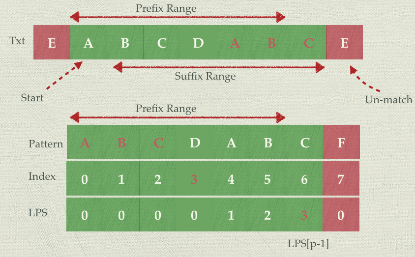

Table of Content
- [FAQ](#FAQ)
- [Walking through a Problem](#Walking-through-a-Problem)
- [Optimize & Solve Technique](#Optimize--Solve-Technique)
- [Codeforces](#Codeforces)
- [Interviewbit](#Interviewbit)
- [Cracking the coding interview](#Cracking-the-coding-interview)
- [Leetcode](#Leetcode)
  - [Classification](#Classification)
  - [Math](#Math)
  - [String](#String)
  - [Array](#Array)
  - [Matrix](#Matrix)
  - [Linked List](#Linked-List)
  - [Stack and Queue](#Stack-and-Queue)
  - [Cache](#Cache)
  - [Tree](#Tree)
  - [Binary Search Tree](#Binary-Search-Tree)
  - [Trie (Prefix Tree)](#Trie-Prefix-Tree)
  - [BFS & DFS](#BFS--DFS)
  - [Dynamic Programming](#Dynamic-Programming)
  - [Topological Sort](#Topological-Sort)
  - [Bit Mamipulation](#Bit-Mamipulation)

## FAQ
  * [What is tail recursion?](https://stackoverflow.com/questions/33923/what-is-tail-recursion)

## [Walking through a Problem](http://www.crackingthecodinginterview.com/resources.html)
  1. Listen Carefully
     * For example:
       * Given two arrays that are **sorted** ...
  2. Draw an Example
     * **There'a an art to drawing an example though**.
     * Most examples are too small or are special cases.
  3. State a Brute Force
     * Even if it's obvious for you, it's not ncecessarily obvious for all candidates. You don't want your interviewer to think you're struggling to see even the wasy solution.
  4. Optimize
     * Look for any **unused information**.
     * Use a fresh example
     * Solve it "incorrectly"
     * Make **time vs. space** tradeoff
     * **Precompute** information
       * Is there a way that you can reorganize the data (sortig, etc.)
     * Use a **hash table**
     * Thank about the best conceivable runtime
  5. Walk Through
     * Whiteboard coding is **slow**, you need to make sure that you get is as close to "perfect" in the beginning as possible.
  6. Implement
     * Modularized code
     * Error checks
       * A good compromise here is to add a todo and then just explain out loud what you'd like to test
     * Use other classes/structs where appropriate
     * Good variable names
  7. Test
     * Conceptual test
       * Does the code do what you think it should do?
     * Weird looking code
       * Doulbe check that line of code that says x = length -2.
     * Hot spots
       * Like base cases in recursive code. Integer division. Null nodes in binary tree.
     * Small test cases
     * Special cases
       * null of single element values.

## [Optimize & Solve Technique](http://www.crackingthecodinginterview.com/resources.html)
1. Look for **BUD**
   * **B**ottlenecks *
    * For example, suppose you have a two-step algorithm where you first sort the array and then you find elements with a particular property.
      * The first step is O(nlong(n)) and the second step if O(n).
      * Perhaps you could reduce the second step to O(1), but would it matter? Not too much as o(nlong(n)) is the bottleneck
   * **U**nnecessary work
   * **D**uplicated work
2. Do it yourself
3. **Simplify and Generalize** *
   * First, we simplify or tweak some constraint, such as the data type. Then we solve this new simplified version of the problem. Finally, once we have an algorithm for the simplified problem, we try to adapt it for the more complex version.
4. **Base case and Build** **
   * Solve the problem first for a base case (e.g., n=1) and then try to build up from there. **When we get to more complex cases (often n=3 or n=4), we try to build those using the prior solution**.
5. Data Structure Brainstorm **
   * Try to run through a list of data structures and try to apply each one.
6. **Best Conceivable Runtime** (BCR)
   * The best conceivable runtie is, literally, the **best runtime** you could conceive of a solution to a problem. You can easily prove that there is no way you could beat the BCR.


## [Codeforces](https://codeforces.com/)
  * If you can achieve **1800 scores within 1 hour** that would be highly recommended for Google applicants.

## [Interviewbit](https://www.interviewbit.com/courses/programming/)
  * Level1:
    * Time Complexity
  * Level2:
    * Arrays
    * Math
  * Level3:
    * Binary Search
    * Strings
    * Bit Manipulation
    * Two Pointers
  * Level4:
    * Linked Lists
    * Stack and Queues
  * Level5:
    * Backtracking
    * Hashing
  * Level6:
    * Heaps And Maps
    * Tree
  * Level7:
    * Dynamic Programming
    * Greedy Algorithm
  * Level8
    * Graph Data Structure & Algorithms

## [Cracking the coding interview](http://www.crackingthecodinginterview.com/)

## [Leetcode](https://leetcode.com/)
### [Classification](https://cspiration.com/leetcodeClassification#103)
### Math
  * Reorder
    * 7: Reverse Integer
      * Notice the boundary
      ```python
      def reverse(self, x: int) -> int:
        is_positive = True if x >=0 else False
        reverse = 0
        boundary = (2 ** 31)//10 # 2147483640

        if not is_positive:
            x = -x

        while x:
            pop = x % 10
            x //= 10
            # boundary = 214748364
            # boundary * 10 = 2147483640
            # 2**31 = 2147483648 = 2147483640 + 8 = boundary * 10 + 8
            if reverse > boundary or reverse == boundary and pop > 7 :
                return 0

            reverse = reverse * 10 + pop

        if not is_positive:
            reverse = -reverse

        return reverse
      ```
  * Sum
    * 01: Two Sum (E)
      * Time: O(n), Space: O(n)
        * Use hash table
      * Find all available 2 sums: O(nlog(n))
        * O(nlogn)
          * Sorting
          * Left pointer and right pointer to find sum of left + right == target
    * 15: 3Sum (M)
      * Time **O(n^2)**
        1. **Sort** first
        2. For each target (from 0 to n-3)
             * Find left and right pair that num[target] + num[left] + num[right] = 0
             * Target = -num[target] = num[left] + num[right]
      * Why does the algorithm work?
          * Assume that we find a correct target for num[left] + num[right]
            * case1: x
              * nums[left+1] + nums[right+1] > Target
            * case2: x
              * nums[left-1] + nums[right-1] < Target.
            * case3: ✓
              * nums[left+1] + nums[right-1] may be possible.
            * case4: x
              * nums[left-1] + nums[r+1] has been traverse before.
      * Python Solution
          ```python
          def threeSum(self, nums: List[int]) -> List[List[int]]:
            res = list()
            nums.sort()

            # from 0 to num-3
            for i in range(0, len(nums)-2):

                # skip duplicate
                if i > 0 and nums[i] == nums[i-1]:
                    continue

                l, r = i+1, len(nums)-1

                while l < r:
                    s = nums[i] + nums[l] + nums[r]

                    if s < 0:
                        l += 1

                    elif s > 0:
                        r -= 1

                    else:  # s == 0
                        res.append([nums[i], nums[l], nums[r]])
                        # skip duplicate
                        while l < r and nums[l] == nums[l+1]:
                            l += 1
                        while l < r and nums[r] == nums[r-1]:
                            r -= 1

                        l+=1
                        r-=1

              return res
          ```
    * 18: 4Sum (M)
  * Other
### String
   * **Edit Distance**
     * 161: One Edit Distance (M)
       * Time O(1), Space (1):
         * Merge the insert and remove cases (find the short one)
         * Use short and long string pointers to traverse and compare
     * 072: Edit Distance (H)
   * **SubString**
     * 028: Implement **strStr** (E)
       * Find Sub-String
       * Brute Force, Time: O(mn), Space(1)
       * **KMP (substring match)**,  Time: O(m+n), Space: O(n)
         * Time: O(m+n), Space: O(n),
           * where m is the length of txt stringm n is the length of the pattern string.
         * Reference:
           * [Concept](https://www.youtube.com/watch?v=GTJr8OvyEVQ)
             * **Reuse the longest common prefix suffix for next pattern searching**.
               * **The current suffix range is the next prefix range**.
                 * please see the figure below
           * [The LPS table](http://jakeboxer.com/blog/2009/12/13/the-knuth-morris-pratt-algorithm-in-my-own-words/)
             * Definiton of **Proper Prefix** and **Proper Suffix**
               * For a pattern: "Snape"
                 * The **Proper Prefix** would be:
                   * S, Sn, Sna, Snap
                 * The **Proper Suffix** would be:
                   * nape, ape, pe, e
             * Definition of the value in prefix suffix table
               * **The length of the longest proper prefix** in the (sub)pattern that matches a proper suffix in the same (sub)pattern.
           * Example
             * 
               * When un-macth happends, **the max reusable string range for next round is in suffix range**.
               * Seach from LPS array and find the proper start position of pattern comparison pointer (in this example, index 3).
         * Python Solution
           ```python
           def get_lps(pattern):

               # init lps array
               lps = [None] * len(pattern)
               lps[0] = 0

               p = 0  # prefix pointer
               s = 1  # suffix pointer

               while s < len(pattern):
                   if pattern[s] == pattern[p]:
                       p += 1
                       lps[s] = p  # update suffix length
                       s += 1
                   else:
                       if p > 0:
                           # reuse the prefix string that has been scanned.
                           # The length of the longest common prefix suffix
                           # are put in lps[p-1]
                           p = lps[p-1]
                       else:  # p = 0
                           # do not match anything
                           lps[s] = 0
                           s += 1
               return lps

           def is_substring(txt: str, pattern: str) -> int:
               if not pattern or len(pattern) == 0:
                   return 0

               res = not_found = -1
               lps = get_lps(pattern)
               i = j = 0
               while i < len(txt):
                   if txt[i] == pattern[j]:
                       i += 1
                       j += 1
                       if j == len(pattern):
                           res =  i - j
                           break
                   else:
                       if j > 0:
                           # reuse the prefix string that has been scanned.
                           # The length of the longest common prefix suffix
                           # are put in lps[p-1]
                           j = lps[j-1]
                       else: # j = 0
                           # do not match anything
                           i += 1
               return res
           ```
     * 003:	Longest Substring Without Repeating Characters (M)
     * 395: Longest Substring with At Least K Repeating Characters (M)
     * 030: Substring with Concatenation of All Words (H)
     * 076: Minimum Window Substring (H)
     * 340: Longest Substring with At Most K Distinct Characters (H)
     * 159: Longest Substring with At Most Two Distinct Characters (H)
   * **Palindrome**
     * 125:	Valid Palindrome (E)
       * Time O(n), Space O(1)
       * Python Solution
        ```python
        def isPalindrome(self, s: str) -> bool:
            l = 0
            r = len(s)-1
            while l < r:

                while l < r and not s[l].isalnum():
                    l += 1
                while l < r and not s[r].isalnum():
                    r -= 1

                if l >= r:
                    break

                if s[l].lower() != s[r].lower():
                    return False

                l += 1
                r -= 1

            return True
          ```
     * 266:	Palindrome Permutation (E)
       * Time O(n), Space O(c)
       * Python Solution
          ```python
          def canPermutePalindrome(self, s: str) -> bool:
            d = collections.defaultdict(int)
            odd = 0

            for c in s:
                d[c] += 1
                # odd
                if d[c] % 2 == 1:
                    odd += 1
                # even
                else:
                    odd -= 1

            return odd <= 1
          ```
     * 005: Longest Palindromic Substring (M)
       * Ref:
         * https://leetcode.com/problems/longest-palindromic-substring/solution/
       * Dynamic Programming, Time: O(n^2), Space: O(n^2)
         * Rule1: (single character)
           * P(i,i)=true
         * Rule2: (two characters)
           * P(i,i+1)=(S(i)==S(i+1))
         * Rule3:
           * P(i,j)=(P(i+1,j-1) and S(i)==S(j))
         * Python Solution
            ```python
            def longestPalindrome(self, s: str) -> str:
              if not s:
                  return ""

              l = len(s)
              # memo[i][j], s[i:j+1] is a palindrom or not
              memo = [[False for _ in range(l)] for _ in range(l)]
              max_length = start = end = 0

              for i in range(0, l):
                  # case1: single character
                  # [0,0], [1,1], ...
                  memo[i][i] = True

                  if i+1 == l:
                    break

                  # case2: two characters
                  # [0, 1], [1, 2], ...
                  if s[i] == s[i+1]:
                      memo[i][i+1] = True
                      # i-j + 1 = 2 in this case
                      if 2 > max_length:
                          max_length = 2
                          start, end = i, i+1
                  else:
                      memo[i][i+1] = False

              # (5,5)       -> skip the length <= 2
              # (4,4) (4,5) -> skip the length <= 2
              # (3,3) (3,4) -> skip, (3,5) start
              # (2,2) (2,3) -> skip, (2,4), (2,5) start
              # ....
              # from l-3 to 0
              for i in range(l-3, -1, -1):
                  # from i+2 to l-1, skip case1 and case2
                  for j in range(i+2, l):
                      # case3
                      if s[i] == s[j] and memo[i+1][j-1]:
                          memo[i][j] = True
                          if (j - i + 1) > max_length:
                              max_length = j - i + 1
                              start, end = i, j
                      else:
                          memo[i][j] = False

              return s[start:end+1]
            ```
       * Expand Center Time: O(n^2), Space: O(1)
         * **Expand the center**, there are total 2n-1 center
           * odd case:
             * aba -> the center is b
           * even case
             * abba -> the center is between bb
         * Python Solution
          ```python
          def expand_center(s, left, right):
              while left > -1 and right < len(s) and s[left] == s[right]:
                  left -= 1
                  right += 1

              # out of boundary or s[left] != s[right]
              # so return left+1, right-1
              return left+1, right-1

          def longestPalindrome(self, s: str) -> str:
              l, r = 0, 0
              # total 2n-1 center
              for center in range(len(s)):
                  # odd case, like aba, the center is b
                  l1, r1 = expand_center(s=s, left=center, right=center)
                  if (r1 - l1) > (r - l):
                      l, r = l1, r1

                  # even case, like abba, the center is between 2b
                  l2, r2 = expand_center(s=s, left=center, right=center+1)
                  if (r2 - l2) > (r - l):
                      l, r = l2, r2

              return s[l:r+1]
            ```
       * Time: O(n), Space: O(n^2), Manacher's Algorithm
   * **Parentheses**
     * 020: Valid Parentheses (E)
       * Python Solution
         ```python
         BRACKET_MAP = {'(': ')', '[': ']', '{': '}'}
         def is_valid_parentheses(self, s: str) -> bool:
             if not s:
                 return True

             ret = True
             stack = list()
             for c in s:
                 if c in BRACKET_MAP:
                     stack.append(c)
                 else:
                     # can not find the left bracket
                     if not stack or c != BRACKET_MAP[stack.pop()]:
                         return False

             # if len(stack) !=0 means that can not find the right bracket
             return len(stack) == 0
         ```
     * 022: Generate Parentheses (M)
     * 241: Generate Parentheses (M)
     * 032:	Longest Valid Parentheses (H)
     * 301: Remove Invalid Parentheses
   * **Subsequence**
     * Longest Common Subsequence (LCS)
       * Ref:
         * https://www.youtube.com/watch?v=NnD96abizww
       * Dynamic Programming: Time: O(n^2), Space: O(n^2)
         * Python Solution
           ```python
            @staticmethod
            def traverse_lcs_memo(s1, s1_idx, s2, s2_idx, memo):
                """ traverse the memo array to find lcs
                """
                lcs_len = memo[s1_idx][s2_idx]
                lcs = [None] * lcs_len
                i, j = s1_idx, s2_idx

                while lcs_len:
                    if s1[i] == s2[j]:
                        lcs_len -= 1
                        lcs[lcs_len] = s1[i]
                        i -= 1
                        j -= 1
                    else:
                        if memo[i][j] == memo[i-1][j]:
                            i -= 1
                        else:  # memo[i][j] == memo[i][j-1]
                            j -= 1

                return "".join(lcs)

            @staticmethod
            def lcs(s1, s2):
                """
                Longest common sequence
                Time: O(n^2), Space: O(n^2)
                Ref: https://www.youtube.com/watch?v=NnD96abizww
                """
                if not s1 or not s2:
                    return ""

                l1, l2 = len(s1), len(s2)

                memo = [[0 for _ in range(l2)] for _ in range(l1)]

                if s1[0] == s2[0]:
                    memo[0][0] = 1

                # init first row
                for j in range(1, l2):
                    if memo[0][j-1] or s2[j] == s1[0]:
                        memo[0][j] = 1

                # init first column
                for i in range(1, l1):
                    if memo[i-1][0] or s1[i] == s2[0]:
                        memo[i][0] = 1

                # complete the memo
                for i in range(1, l1):
                    for j in range(1, l2):
                        if s1[i] == s2[j]:
                            memo[i][j] = memo[i-1][j-1] + 1
                        else:
                            memo[i][j] = max(memo[i-1][j], memo[i][j-1])

                return StrUtils.traverse_lcs_memo(s1, l1-1,
                                                  s2, l2-1,
                                                  memo)
           ```
   * **Reorder**
     * 344: Reverse String (E)
     * 541: Reverse String II (E)
       * You need to **reverse the first k characters for every 2k characters** counting from the start of the string.
         * input:  s = "abcdefg", k = 2
         * output: "bacdfeg"
       * Python Solution
        ```python
          def reverseStr(self, s: str, k: int) -> str:
              if k <= 1 :
                  return s

              l = list(s)
              length = len(l)
              start = 0

              while start < length:
                  end = min(length-1, start+(k-1))
                  self.reverse_list(l, start, end)
                  start += 2*k

              return ''.join(l)
        ```
     * 151:	Reverse **Words** in a String	(M)
       * Time O(n), Space O(n) (one pass)
         * From end to beginning of the string
         * Python solution
          ```python
          def reverseWords(self, s: str) -> str:
            w_end = len(s) - 1
            left_boundary = -1
            output = list()

            while w_end > left_boundary:
                while w_end-1 > left_boundary and s[w_end].isspace():
                    w_end -= 1

                # can not find the word
                if s[w_end].isspace():
                    break

                w_start = w_end
                while w_start-1 > left_boundary and not s[w_start-1].isspace():
                    w_start -= 1

                if output:
                    output.append(" ")

                output.append(s[start:w_end+1])

                w_end = start - 1

            return "".join(output)
          ```
       * Time O(n), Space O(n)
         * Reverse the string, from left to right, reverse each word.
         * Python solution
          ```python
          def reverseWords(self, s: str) -> str:
            # 1. trim extra space
            # 2. transfer to list
            # 3. reverse the list
            l = list(" ".join(s.split()))[::-1]

            w_start = 0
            while w_start < len(l):
                while w_start+1 < len(l) and l[w_start].isspace():
                    w_start += 1

                # can not find the word
                if l[w_start].isspace():
                    break

                w_end = w_start
                while w_end+1 < len(l) and not l[w_end+1].isspace():
                    w_end +=1

                self.reverse_list(l, w_start, w_end)

                w_start = w_end + 1

            return "".join(l)
            ```
     * 186:	Reverse **Words** in a String II (M)
       * Python Solution
       ```python
        def reverse_list(l, start, end):
            while start < end:
                l[start], l[end] = l[end], l[start]
                start += 1
                end -= 1

        def reverseWords(self, s: List[str]) -> None:
            """
            Do not return anything, modify s in-place instead.
            """
            self.reverse_list(s, 0, len(s)-1)

            w_start = 0
            boundary = len(s)

            while w_start < boundary:
                while w_start + 1 < boundary and s[w_start].isspace():
                    w_start += 1

                if s[w_start].isspace():
                    break

                w_end = w_start
                while w_end + 1 < boundary and not s[w_end + 1].isspace():
                    w_end += 1

                reverse_list(s, w_start, w_end)

                w_start = w_end + 1
       ```
     * 345:	Reverse **Vowels** of a String (E)
       * Python Solution
       ```python
        def reverseVowels(self, s: str) -> str:
          vowels = collections.Counter('aeiouAEIOU')
          l = list(s)
          start,end = 0, len(l) - 1

          while start < end:
              while start < end and l[start] not in vowels:
                  start += 1

              while start < end and l[end] not in vowels:
                  end -= 1

              if start >= end:
                  break

              l[start], l[end] = l[end], l[start]
              start +=1
              end -= 1

         return "".join(l)
       ```
   * **Isomorphism** and **Pattern**
     * 205: **Isomorphic** Strings (E)
        * Example:
          * aabbaa,  112233 -> False
          * aabbaa,  112211 -> True
        * Use hash Table to store **last seen index**
        * Python Solution
          ```python
          def isIsomorphic(self, s: str, t: str) -> bool:
            # -1 means that this char does not appear before
            f = lambda: -1
            d1 = collections.defaultdict(f)
            d2 = collections.defaultdict(f)

            for i in range(0, len(s)):
                if d1[s[i]] != d2[t[i]]:
                    return False

                d1[s[i]] = d2[t[i]] = i

            return True
          ```
     * 290: Word Pattern (E)
       * The same concept as 205
       * Python Solution
         ```python
         def wordPattern(self, pattern: str, str: str) -> bool:

          if not str or not pattern:
              return False

          f = lambda : -1
          d1 = collections.defaultdict(f)
          d2 = collections.defaultdict(f)

          txt = str.split()

          if len(pattern) != len(txt):
              return False

          for i in range(len(pattern)):
              if d1[pattern[i]] != d2[txt[i]]:
                  return False
              d1[pattern[i]] = d2[txt[i]] = i

          return True
         ```
   * **Anagram**
     * The key is how to calculate signatures.
     * 242: Valid Anagram (E)
       * Python Solution
        ```python
        def isAnagram(self, s: str, t: str) -> bool:
          if len(s) != len(t):
              return False

          d = collections.defaultdict(int)

          for c in s:
              d[c] += 1

          for c in t:
              if d[c] == 0:
                  return False

              d[c] -= 1

          return True
       ```
     * 049: Group Anagrams (M)
       * n is the number of strings, k is the maximum length of the strings
       * Categorize by sorted string, Time: O(n*klog(k)) Space: O(nk)
         * Python Solution
            ```python
            def groupAnagrams(self, strs: List[str]) -> List[List[str]]:
              d = collections.defaultdict(list)
              for s in strs:
                d[tuple(sorted(s))].append(s)
            return d.values()
            ```
       * Categorize by Character Count, Time: O(nk), Space: O(nk)
         * Transform each strings into a character count.
         * Python Solution
            ```python
            def groupAnagrams(self, strs: List[str]) -> List[List[str]]:
              d = collections.defaultdict(list)
              ord_a = ord('a')
              for s in strs:
                  # generate character count signature
                  count_arr = [0] * 26
                  for c in s:
                      count_arr[ord(c)-ord_a] += 1

                  # use signature as key
                  d[tuple(count_arr)].append(s)

              return d.values()
            ```
     * 249: Group Shifted Strings (M)
       * Time: O(nk)
         * n is the number of strings
         * k is the length of the string
       * Example:
         * [a, b] and [z, a]
           * ord(a) = 97
           * ord(b) = 98
           * ord(z) = 122
         * (ord(b) - ord(a)) ≡ 1 (mod 26)
         * (ord(a) - ord(z)) ≡ -25 ≡ 1 (mod 26)
         * -1 is **congruent** to -25 (modulo 26)
       * Python Solution
         ```python
         def groupStrings(self, strings: List[str]) -> List[List[str]]:
          d = collections.defaultdict(list)
          for s in strings:
              k = tuple( (ord(c) - ord(s[0]))%26  for c in s)
              d[k].append(s)

          return d.values()
         ```
   * Other
     * 387: First Unique Character in a String (E)
       * Time: O(n), Space: O(c)
         * Use Hash Table
     * 058: Length of Last Word (E)
       * Seach **from the end to the beginning**.
       * Python Solution
        ```python
        def lengthOfLastWord(self, s: str) -> int:
          w_count = 0
          find = False
          # traverse from end to start
          for i in range(len(s)-1, -1, -1):
              if s[i] != ' ':
                  w_count += 1
                  find = True
              else:
                  # we have found a word before
                  if find:
                      break

          return w_count
        ```
     * 014: Longest Common Prefix (E)
       * Use **vertical scanning**, Time: O(mn)
         * Time: O(mn)
           * Where m is the minimum length of str in strs and n is the number of strings.
         * Python Solution
             ```python
             def longest_common_prefix(self, strs: List[str]) -> str:
               if not strs:
                   return ""

              # set string 0 as vertical prefix
               prefix = strs[0]

               # Vertical Scanning
               for i in range(0, len(prefix)):
                   c = prefix[i]
                   for j in range(1, len(strs)):
                       # break if out of boundary or non-equal
                       if i == len(strs[j]) or strs[j][i] != c:
                           # backward one character
                           prefix = prefix[:i]
                           found = True
                           break

                   if found:
                       break

               return prefix
             ```
     * 383: Ransom Note (E)
        * Use Hash Table
     * 293: Flip Game (E)
        * python solution
        ```python
        def generatePossibleNextMoves(self, s: str) -> List[str]:
          output = list()
          # from 0 to n-2
          for i in range(len(s)-1):
              if s[i] == s[i+1] == '+':
                  output.append(f"{s[0:i]}--{s[i+2:]}")
          return output
        ```
     * 294: Flip Game II (M)
       * backtracking: Time: O(n!!), Space: O(n*2)
         * Double factorial: (n-1) * (n-3) * (n-5) * ... 1=
          * python solution
            ```python
            def canWin(self, s: str) -> bool:
              # from 0 to len(s)-2
              for i in range(0, len(s)-1):

                  # the 1st flip
                  if s[i] == s[i+1] == '+':
                      first_flip_s = f"{s[0:i]}--{s[i+2:]}"

                      # the 2nd flip
                      if not self.canWin(first_flip_s):
                          # 1st person wins the game
                          return True

              # can not make any flips
              # 1st person loses the game
              return False
            ```
       * backtracking with memo
         * time complexity:
           * number_of_distinct_strings * each_unique_string_first_time_computation_contribution
             * O(2^n) * n (not sure)
         * space complexity:
           * O(n^2)
         * python solution
            ```python
            def canWin(self, s: str) -> bool:
              memo = dict()

              def _canWin(self, s):
                  if s in memo:
                      return memo[s]

                  # from 0 to len(s)-2
                  for i in range(0, len(s)-1):
                      if s[i] == s[i+1] == '+':
                          first_flip_s = f"{s[0:i]}--{s[i+2:]}"
                          # the 2nd flip
                          if not self.canWin(first_flip_s):
                              # first person wins the game
                              memo[s] = True
                              return True

                  # can not make any flips
                  # first person loses the game
                  memo[s] = False
                  return False

              return _canWin(self, s)
            ```
### Array
  * **Check Duplicate**
    * 217: Contains Duplicate (E)
      * Use hash Table
    * 219: Contains Duplicate II (E)
      * find out whether there are two distinct indices i and j in the array such that nums[i] = nums[j] and the absolute difference between i and j is at most k.
      * Use hash Table to store index.
      * Python Solution
      ```python
      def containsNearbyDuplicate(self, nums: List[int], k: int) -> bool:
        hash_table = dict()
        for i, num in enumerate(nums):

            if num in hash_table and (i - hash_table[num]) <= k:
                return True

            hash_table[num] = i

        return False
      ```
  * **Remove Duplicate**
    * 027: Remove elements (E)
      * Like partition step of quick sort (keep the border)
      * Copy the wanted elements to the position of the current border
      * Python Solution
        ```python
        def removeElement(self, nums: List[int], val: int) -> int:
          border = 0
          for num in nums:
              if num != val:
                  nums[border] = num
                  border += 1

          return border
        ```
    * 026: Remove **Duplicates** from **Sorted Array** (E)
      * Python Solution
        ```python
        def removeDuplicates(self, nums: List[int]) -> int:
          i = 0
          for j in range(1, len(nums)):
              if nums[j] != nums[i]:
                  i += 1
                  nums[i] = nums[j]
          return i + 1
        ```
    * 080: Remove **Duplicates** from **Sorted Array** II (M) *
      * Python Solution
      ```python
      def removeDuplicates(self, nums: List[int]) -> int:
        i = 2
        for j in range(3, len(nums)):
            if nums[j] > nums[i-2]:
                nums[i] = nums[j]
                i += 1
        return i
      ```
  * **Container**
    * 011: Container With Most Water (M)
      * Greedy, Time O(n)
        * How to calculate the area:
          * min(left_border, right_border) * width
        * 2 pointers approach, Time: O(n), Space: O(1)
          * Move the index with shorter height to find the bigger area.
          * Python Solution
            ```python
            def maxArea(self, height: List[int]) -> int:
              start, end = 0, len(height)-1
              max_area = 0

              while start < end:
                  h = min(height[start], height[end])
                  w = end - start
                  cur_area = h*w
                  max_area = max(max_area, cur_area)

                  # move the smaller one
                  if height[start] <= height[end]:
                      start += 1
                  else:
                      end -= 1

              return max_area
            ```
    * 042: Trapping Rain Water (H) *
      * Ref:
        * [Solution](https://leetcode.com/problems/trapping-rain-water/solution/)
      * How to calculate the area ?
        * Sum water amount of **each bin** (width=1)
          * Find left border
          * Find right border
          * Water area in the ith bin would be:
            * **min(left_border, right_border) - height of ith bin**
      * Dynamic Programming, Time: O(n), Space: O(n)
        * Keep two arrays
          * left_max
            * The left_max[i] is the **left border** in ith bin.
          * right_max
            * The right_max[i] is the **right border** in ith bin.
          * Python Solution
            ```python
            def trap(self, height: List[int]) -> int:
              if not height:
                  return 0

              area = 0
              l = len(height)

              left_max = [None] * l
              right_max = [None] * l

              left_max[0] = height[0]
              right_max[l-1] = height[l-1]

              # calculate left border array
              for i in range(1, l):
                  left_max[i] = max(height[i], left_max[i-1])

              # calculate right border array
              for i in range(l-2, -1, -1):
                  right_max[i] = max(height[i], right_max[i+1])

              # sum the area for each bin
              for l_max, r_max, h in zip(left_max, right_max, height):
                  area += min(l_max, r_max) - h

              return area
            ```
      * 2 pointers approach, Time: O(n), Space: O(1)
          * [Concept]((https://leetcode.com/problems/trapping-rain-water/solution/))
            * If the right border > left border, the area of ith bin is determined by the left border.
            * vice versa
            * So we fix the higher border, and move the lower border to calcualte the area
          * Python Solution
            ```python
            def trap(self, height: List[int]) -> int:
              area = 0
              if not height:
                  return area

              left, right = 0, len(height)-1
              max_left = max_right = 0

              while left < right:
                  # determine the border
                  # area depends on left border
                  if height[left] <= height[right]:
                      if height[left] >= max_left:
                          max_left = height[left]
                      else:
                          area += (max_left - height[left])
                      left += 1

                  # area depends on right border
                  else:
                      if height[right] > max_right:
                          max_right = height[right]
                      else:
                          area += (max_right - height[right])
                      right -= 1

              return area
            ```
  * **Jump Game**:
    * 055: Jump Game (M)
      * [Solution](https://leetcode.com/problems/jump-game/solution/)
      * Dynamic Programming
        * We call a position in the array a **"good index" if starting at that position, we can reach the last index.** Otherwise, that index is called a "bad index".
           ```python
           class Status(object):
              UNKNOWN = 1
              GOOD = 2
              BAD = 3
           ```
        * Top Down Approach, Time: O(n^2), Space: O(n)
          * Python Solution
            ```python
            def canJump(self, nums: List[int]) -> bool:
                length = len(nums)
                memo = [Status.UNKNOWN] * length
                memo[length-1] = Status.GOOD

                def _can_jump_from_position(nums: List[int], start: int):

                    if memo[start] is not Status.UNKNOWN:
                        return True if memo[start] is Status.GOOD else False

                    # max_jump = 0 would cause Status.BAD
                    max_jump = min(start+nums[start], length-1)

                    # from max_jump to start + 1
                    for jump in range(max_jump ,start, -1):
                        if _can_jump_from_position(nums, start=jump):
                            memo[start] = Status.GOOD
                            return True

                    # failed
                    memo[start] = Status.BAD
                    return False

               return _can_jump_from_position(nums, start=0)
            ```
        * Buttom Up Approach, Time: O(n^2), Space: O(n)
          * Python Solution
            ```python
            def canJump(self, nums: List[int]) -> bool:
              length = len(nums)
              memo = [Status.UNKNOWN] * length
              memo[length-1] = Status.GOOD

              # start from length-2 to 0
              for start in range(length-2, -1, -1):
                  max_jump = min(start+nums[start], length-1)
                  # jump from max_jump to start
                  for jump in range(max_jump, start, -1):
                      # find the first good index
                      if memo[jump] == Status.GOOD:
                          memo[start] = Status.GOOD
                          break

              return memo[0] == Status.GOOD
            ```
      * Greedy, Time: O(n), Space: O(1)
        * **The main concept is to keep the left most good index**
          * If we can reach a GOOD index, then our position is a GOOD index as well. and this new GOOD index will be the new leftmost GOOD index.
        * Python Solution
          ```python
          def canJump(self, nums: List[int]) -> bool:
            length = len(nums)
            left_most_good_idx = length - 1

            # from length-2 to 0
            for start in range(length-2, -1, -1):
              if start + nums[start] >= left_most_good_idx:
                  left_most_good_idx = start

            return left_most_good_idx == 0
          ```
    * 045: Jump Game II (H) *
      * [Greedy](https://leetcode.com/problems/jump-game-ii/discuss/18014/Concise-O(n)-one-loop-JAVA-solution-based-on-Greedy)
        * Find the minimum jump
        * Greedy
          * Time: O(n), Space: O(1)
          *  **cur == cur_border**, like BFS solution
             *  means you visited all the items on the current level
             *  Incrementing jumps+=1 is like incrementing the level you are on.
          *  And **cur_end = cur_farthest** is like getting the queue size (level size) for the next level you are traversing.
        *  Python Solution
            ```python
            def jump(self, nums: List[int]) -> int:
              jump_cnt = cur_border = cur_farthest = 0
              for cur in range(0, len(nums)-1):
                  cur_farthest = max(cur_farthest, cur+nums[cur])
                  # the boundary need to jump
                  if cur == cur_border:
                      jump_cnt +=1
                      # determine the next border
                      cur_end = cur_farthest

              return jump_cnt
            ```
  * **H-Index**
    * 274: H-Index (M)
      * Use Hash Table, Time O(n), Space O(n)
        * Concept
          * **The max index in the array would be len(array)**, that is we can restrict the number of the buckets.
        * Use Hash table to accumulate the cnt of citations
        * Python Solution
            ```python
            def hIndex(self, citations: List[int]) -> int:

                max_cita = len(citations)
                d = collections.defaultdict(int)

                for val in citations:
                  d[min(max_cita, val)] += 1

                h_index = cita_cnt = 0
                # from max_cita to 1
                for cita in range(max_cita, 0, -1):
                  cita_cnt += d[cita]
                  if cita_cnt >= cita:
                    h_index = cita
                    break

                return h_index
            ```
      * Use Sort, Time: O(nlog(n)), Space: O(1)
        * Concept:
          * Refer 275: H-Index II
    * 275: H-Index II
      * Linear search: O(n)
        * Concept
          * Sort the citations array in **ascending order** (draw it).
          * c = citations[i]. We would know that the number of articles whose citation number is higher than c would be n - i - 1.
          * And together with the current article, **there are n - i articles that are cited at least c times**.
        * Python Solution
          ```python
          def hIndex(self, citations: List[int]) -> int:
            h_index = 0
            max_cita = len(citations)

            for idx, cita in enumerate(citations):
              if cita >= (max_cita-idx):
                  h_index = (max_cita-idx)
                break

            return max_cita_index
          ```
      * **Binary Search**: O(log(n))
        * Ref:
          * https://leetcode.com/problems/h-index-ii/discuss/71063/Standard-binary-search
          * https://leetcode.com/problems/h-index-ii/solution/
        * About final condition max_cita - (right + 1) = max_cita - left
          * The algorithm will jump out op while loop. We know for binary search, if it cannot find the target, **pointers left and right will be right besides the location which should be the target**.
              ```text
                  left
                    v
              0, 1, 4, 5, 7
                 ^
              right
              ```
          * For the case, (left, **right, new_left**)
            * Old range can not satisfied the requirement.
          * For the case, (**new_right, left**, right)
            * Old range can satisfied the requirement.

        * Python Solution
          ```python
          def hIndex(self, citations: List[int]) -> int:
            max_cita = len(citations)
            left = 0
            right = max_cita - 1

            while left <= right:
                mid = (left + right) // 2
                if citations[mid] == (max_cita - mid):
                    return max_cita - mid

                # search right section
                elif citations[mid] < (max_cita - mid):
                    left = mid + 1

                # search left section
                else:
                    right = mid - 1

            #return max_cita - left
            return max_cita - (right+1)
          ```
  * **Best Time to Buy and Sell Stock**
    * [General solution](https://leetcode.com/problems/best-time-to-buy-and-sell-stock-with-transaction-fee/discuss/108870/Most-consistent-ways-of-dealing-with-the-series-of-stock-problems)
    * 121: Best Time to Buy and Sell Stock (E), Time:O(n), Space:O(1)
      * Allow **1 transaction only**.
      * For each round, keep the current minimum buy price and update best sell prcie.
      * Python Solution:
        ```python
        def maxProfit(self, prices: List[int]) -> int:
          if not prices:
              return  0

          max_profit = 0
          min_price = prices[0]

          for i in range(1, len(prices)):
              profit = prices[i] - min_price
              max_profit = max(profit, max_profit)
              min_price = min(prices[i], min_price)

          return max_profit
        ```
    * 122: Best Time to Buy and Sell Stock II (E), Time:O(n), Space:O(1)
      * Multiple transcation allowed.
      * [**Peak Valley** Approach](https://leetcode.com/problems/best-time-to-buy-and-sell-stock-ii/solution/)
        * Python Solution1
           ```python
           valley = peak = prices[0];
           max_profit = 0
           while i < len(prices) - 1:
              # find the valley
              while i < len(prices) - 1 and price[i] >= prices[i+1]:
                  i += 1
              valley = prices[i]

              while i < len(prices) - 1 and price[i] <= prices[i+1]:
                  i += 1
              peak = prices[i]

              max_profit += (peak - valley);
           ```
        * Python Solution2
          ```python
          max_profit = 0
          for i in range(1, len(prices)):
              if prices[i] > price[i-1]:
                  max_profit += prices[i] - price[i-1]
          ```
    * 714: Best Time to Buy and Sell Stock with Transaction Fee (M), Time:O(n), Space:O(1)
      * Ref:
        * [solution](https://leetcode.com/problems/best-time-to-buy-and-sell-stock-with-transaction-fee/solution/)
      * Cash(i):
        * The cash in hand, if you are **not holding the stock** at the end of day(i):
          * case1:
            * cash[i] = cash[i-1]
          * case2:
            * cash[i] = hold[i-1] + prcie[i] - fee
          * cash[i]
            * max(case1, case2) = max(cash[i-1], hold[i-1] + prcie[i] - fee)
      * Hold(i):
        * The cash in hand, if you are **holding the stock** at the end of day(i):
          * case1:
            * hold[i] = hold[i-1]
          * case2:
            * hold[i] = **hold[i-1] + price[i] - fee** - price[i]
          * case3:
            * hold[i] = **cash[i-1]** - price[i]
          * case2 and case3 can be reduced to
            *  **cash[i]** - price[i]
          * hold[i]
            * max(case1, case2, case3) = max(hold[i-1], **cash[i]-price[i]**)
      * Python Solution
          ```python
          def max_profit(self, prices: List[int], fee: int) -> int:
            cash = 0
            hold = -prices[0]

            for i in range(1, len(prices)):
                cash = max(cash, hold+prices[i]-fee)
                hold = max(hold, cash-prices[i])

            return cash
          ```
  * **Shortest Word Distance**
    * 243: Shortest Word Distance (E) *
       *  Calculate the distance and update the shortest distance in each round.
    * 245: Shortest Word Distance III (M) *
      * Allow **duplicated words**.
      * Keep the shortest distance in each round.
      * Python Solution
          ```python
          index1 = index2 = -1
          same = True if word1 == word2 else False

          for index, word in enumerate(words):

            if word == word1:
                if same:
                    index1, index2 = index2, index
                else:
                    index1 = index

            elif word == word2:
                index2 = index

            if index1 != -1 and index2 != -1:
                dist = min(dist, abs(index1-index2))
          ```
    * 244: Shortest Word Distance II (M) **
       * **Init once** and **search for multiple time**.
       * Using **Preprocessed Sorted Indices** and two pointers to traverse
         * Space: O(n)
           * For or the dictionary that we prepare in the constructor.
             * The keys represent all the unique words in the input and the values represent all of the indices from 0 ... N0...N.
         * Time Complexity:
           * Init step:
             * O(n), where n is the number of words.
           * Find the shortest distance :
             * O(K + L)), where K and L represent the number of occurrences of the two words.
         * Python Solution
            ```python
            i = j = 0
            while i < len(list1) and j < len(list2):
              index1, index2 = list1[i], list2[j]
              # move the smaller one
              if index1 < index2:
                  dist = min(dist, index2-index1)
                  i +=1
              else: # index2 < index1
                  dist = min(dist, index1-index2)
                  j += 1
            ```
  * **Interval**
    * 252: Meeting Rooms (E)
      * Check if one person **can attend all meetings**.
      * How to check overlaps
        * Python Solution
          ```python
              min(interval1.end, interval2.end) > max(interval1.start, interval2.start)
          ```
      * Brute Force, Time:O(n^2)
      * Check after sorting, Time:O(nlog(n))
        * For **sorted intervals**
          * Check the overlap between interval[i] and interval[i+1] would be
            * ```python
              interval[i].end > interval[i+1],start
              ```
            * If there is an overlap between interval 3 and interval1, then there is an overlap between interval2 and interval1 as well, since interval2.start < interval3.start.
        * Algo:
          * Sort by start time of intervals
          * Check if interval[i] and intervalp[i+1] have overlap.
      * Python Solution
        ```python
        start, end = 0, 1

        intervals.sort(key=lambda interval: interval[start])

        for i in range(1, len(intervals)):
            if intervals[i][start] < intervals[i-1][end]:
              return False
        return True
        ```
    * 253: Meeting Rooms II (M)
      * Find the minimum requirement of the meeting rooms.
      * Brute Force, Time: O(n^2), Space: O(1)
      * Check after sorting, Time: O(nlog(n)), Space: O(n)
        * [Use Min Heap to store end time of intervals]((https://leetcode.com/problems/meeting-rooms-ii/solution/))
        * Sort the intervals by start time
        * For every meeting room check if the minimum element of the heap is free or not.
          * If the room is free, then we extract the topmost element and add it back with the ending time of the current meeting we are processing.
          * If not, then we allocate a new room and add it to the heap.
        * Python Solution
          ```python
          def minMeetingRooms(self, intervals: List[List[int]]) -> int:
            if not intervals:
                return 0

            start, end = 0, 1
            intervals.sort(key=lambda interval: interval[start])
            heap = list()
            heapq.heappush(heap, intervals[0][end])

            for i in range(1, len(intervals)):
                # heap[0] is current minimum end time
                if heap[0] > intervals[i][start]:
                    heapq.heappush(heap, intervals[i][end])
                else:
                    heapq.heapreplace(heap, intervals[i][end])

            return len(heap)
          ```
    * 056: Merge Intervals (M)
      * Time: O(nlogn), Space: O(1)
        * Sort the intervals by start time,
        * Update the output if there exists interval overlap.
        * Python Solution
          ```python
          start, end = 0, 1
          intervals.sort(key=lambda interval: interval[start])
          output = list()
          output.append(intervals[0].copy())

          for i in range(1, len(intervals)):
              # merge
              cur = intervals[i]
              last = output[-1]
              if last[end] >= cur[start]:
                  last[end] = max(last[end], cur[end])
              else:
                  output.append(cur.copy())

          return output
          ```
    * 057: Insert Interval (H)
    * 352: Data Stream as Disjoint Intervals (H)
  * **Counter**
    * 053: Maximum Subarray (E)
      * [**Kadane's Algorithm**](https://leetcode.com/problems/maximum-subarray/discuss/20211/Accepted-O(n)-solution-in-java) *
       * Python Solution
          ```python
          def max_sub_array(self, nums: List[int]) -> int:
              max_sum = max_sum_so_far = nums[0]

              for i in range(1, len(nums)):
                  max_sum_so_far = max(nums[i], max_sum_so_far+nums[i])
                  max_sum = max(max_sum, max_sum_so_far)

              return max_sum
          ```
    * 152: Maximum **Product** Subarray (M)
      * Time: O(n), Space: O(1)
        * The concept is just like 53: maximum subarray
        * Python Solution
          ```python
          def maxProduct(self, nums: List[int]) -> int:

            g_max = cur_min = cur_max = nums[0]

            for i in range(1, len(nums)):
                # multiplied by a negative makes big number smaller,
                # small number bigger so we redefine the extremums
                # by swapping them
                if nums[i] < 0:
                    cur_min, cur_max = cur_max, cur_min

                cur_max = max(nums[i], cur_max*nums[i])
                cur_min = min(nums[i], cur_min*nums[i])

                g_max = max(cur_max, g_max)

            return g_max
          ```
    * 325: Maximum Size Subarray Sum **Equals k** (M)
      * Find the maximum length of a subarray that sums to k
      * Time: O(n), Space: O(n)
        * [Concept](https://leetcode.com/problems/maximum-size-subarray-sum-equals-k/discuss/77784/O(n)-super-clean-9-line-Java-solution-with-HashMap)
          * Use hash table
            * key: accumulation value
            * val: index
        * Python Solution
          ```python
          def maxSubArrayLen(self, nums: List[int], k: int) -> int:
            max_len = 0
            acc = 0
            d = dict()
            d[0] = -1 # init value for acc == k

            for idx, val in enumerate(nums):
                acc += val

                val_of_start_idx = acc - k
                if val_of_start_idx in d:
                    max_len = max(max_len, idx-d[val_of_start_idx])

                if acc not in d:
                    d[acc] = idx

            return max_len
          ```
    * 560: Subarray Sum **Equals K**, (M) ***
      * [Solution](https://leetcode.com/problems/subarray-sum-equals-k/solution/)
      * Time: O(n^2)m, Space: O(1)
        * python solution
          ```python
          def subarraySum(self, nums: List[int], k: int) -> int:
            cnt = 0
            for start in range(0, len(nums)):
              acc = 0
              for end in range(start, len(nums)):
                acc += nums[s]
                if acc == k:
                  cnt += 1

            return cnt
          ```
      * Time: O(n), Space: O(n)
        * Use hash table to keep acc value.
        * Use incremental val to find the max size of subarray.
        * Python Solution
          ```python
          def subarraySum(self, nums: List[int], k: int) -> int:
            acc = cnt = 0
            d = collections.defaultdict(int)
            d[0] += 1 # init value for acc == k

            for idx, val in enumerate(nums):
                acc += val
                val_of_start_idx = acc - k
                if val_of_start_idx in d:
                    cnt += d[val_of_start_idx]
                d[acc] += 1

            return cnt
          ```
    * 238: **Product** of Array **Except Self** (M)
      * Allow to use Division, Time:O(n)
        * We can simply take the product of all the elements in the given array and then, for each of the elements xx of the array, we can simply find product of array except self value by dividing the product by xx.
        * Special cases
          * exactly 1 zero
          * more than 1 zero
        * Python Solution,
          ```python
          def product_except_self(self, nums: List[int]) -> List[int]:
              zero_cnt = 0
              products = 1
              output = [0] * len(nums)

              for i, num in enumerate(nums):
                  if num != 0:
                      products *= num
                  else:
                      zero_idx = i
                      zero_cnt += 1

              if zero_cnt > 1:
                  pass
              elif zero_cnt == 1:
                  output[zero_idx] = products
              else:
                  for i in range(0, len(nums)):
                      output[i] = int(products/nums[i])

              return output
            ```
      * Not Allow to use Division:
        * [Concept](https://leetcode.com/problems/product-of-array-except-self/solution/)
          * **For every given index i, we will make use of the product of all the numbers to the left of it and multiply it by the product of all the numbers to the right**=.
          * Python Solution:
            ```python
            def product_except_self(self, nums: List[int]) -> List[int]:

              output = [0] * len(nums)
              output[0] = 1

              # left array, for nums[a,b,c,d]
              # left would be [1, a, a*b, a*b*c]
              for i in range(1, len(output)):
                  output[i] = output[i-1] * nums[i-1]

              # right would be [b*c*d, c*d, d, 1]
              # use r to keep the right val
              r = 1
              for i in range(len(output)-1, -1, -1):
                  output[i] = output[i] * r
                  r *= nums[i]

              return output
            ```
    * 228: **Summary** Ranges (M)
      * Given a sorted integer array without duplicates, return the summary of its ranges.
        * Input:
          * [0,1,2,4,5,7]
        * Output:
          * ["0->2","4->5","7"]

      * Python Solution
      ```python
      def summaryRanges(self, nums: List[int]) -> List[str]:
        output = list()

        if not nums:
            return output

        cur_start = cur_end = 0
        while cur_start < len(nums):
            # find the proper position of the end pointer
            while (cur_end + 1) < len(nums) and nums[cur_end] + 1 == nums[cur_end + 1]:
                cur_end += 1

            # format the result
            if cur_start == cur_end:
                output.append(str(nums[cur_start]))
            else:
                output.append(f'{nums[cur_start]}->{nums[cur_end]}')

            # prepare for next range
            cur_start = cur_end = cur_end + 1

        return output
      ```
    * 163: **Missing** Ranges (M)
      * Example:
        * Input: nums = [0, 1, 3, 50, 75], lower = 0 and upper = 99
        * Output: ["2", "4->49", "51->74", "76->99"]
      * Need to know how to handle the boundary properly.
      * Python Solution
      ```python
          def format_result(left_boundary, right_boundary, output):
              diff = right_boundary - left_boundary
              # no missing
              if diff < 2:
                  return
              # missing one
              elif diff == 2:
                  output.append(str(left_boundary+1))
              # missining more than one
              else: # diff > 2
                  output.append(f"{left_boundary+1}->{right_boundary-1}")

          def findMissingRanges(self, nums: List[int], lower: int, upper: int) -> List[str]:

              left_boundary = lower - 1

              output = list()

              for right_boundary in nums:
                  format_result(left_boundary, right_boundary, output)
                  left_boundary = right_boundary

              # final
              right_boundary = upper + 1
              format_result(left_boundary, right_boundary, output)

              return output
      ```
    * 239: Sliding Window Maximum (H)
    * 295: Find Median from Data Stream (H)
  * Reorder and Sort
    * 189: Rotate Array (E)
      * Space: **O(1)**
        * Use **three reverse** operations can solve this problem.
        * Python Solution
          ```python
          def rotate(self, nums: List[int], k: int) -> None:
          """
          Do not return anything, modify nums in-place instead.
          """
          if not nums or not k:
              return

          length = len(nums)

          k = k % length

          if k == 0:
              return

          reverse(nums, 0, length-1)
          reverse(nums, 0, k-1)
          reverse(nums, k, length-1)
          ```
    * 088: Merge Sorted Array (E)
      * You may **assume that nums1 has enough space** (size that is greater or equal to m + n) to hold additional elements from nums2.
      * Space O(1):
        * Fill the arrary **from the end to the start**
        * Python Solution:
        ```python
        def merge(self, nums1: List[int], m: int, nums2: List[int], n: int) -> None:
          """
          Do not return anything, modify nums1 in-place instead.
          """
          merge_runner = len(nums1) - 1
          runner1 = m - 1
          runner2 = n - 1

          while runner1 >= 0 and runner2 >= 0:
              if nums1[runner1] >= nums2[runner2]:
                  nums1[merge_runner] = nums1[runner1]
                  runner1 -= 1
              else:
                  nums1[merge_runner] = nums2[runner2]
                  runner2 -= 1
              merge_runner -= 1

          while runner2 >= 0:
              nums1[merge_runner] = nums2[runner2]
              runner2 -= 1
              merge_runner -=1
        ```
    * 283: Move Zeroes (E)
      * Like the partition step of quick sort
        * **keep the border pointing to next available position.**
        * Python Solution
        ```python
        def moveZeroes(self, nums: List[int]) -> None:
          """
          Do not return anything, modify nums in-place instead.
          """
          if len(nums) <= 1:
              return

          border = 0
          for i in range(0, len(nums)):
              if nums[i] == 0:
                  continue
              nums[border], nums[i] = nums[i], nums[border]
              border += 1
         ```
    * 280: Wiggle Sort (M) *
      * Definition
        * **nums[0] <= nums[1] >= nums[2] <= nums[3]...**
      * O(log(n))
        * Sort and then pair swapping
      * O(n)
        * Greedy from left to right
          ```python
          def wiggleSort(self, nums: List[int]) -> None:
              less = True

              for i in range(len(nums)-1):
                if less:
                  if nums[i] > nums[i+1]:
                    nums[i], nums[i+1] = nums[i+1], nums[i]
                else:
                  if nums[i] < nums[i+1]:
                    nums[i], nums[i+1] = nums[i+1], nums[i]

              less = not less
          ```
  * Other:
    * 277: [Find the Celebrity](https://pandaforme.github.io/2016/12/09/Celebrity-Problem/) (M) *
      1. Find the **celebrity candidate**
      2. Check if the candidate is the celebrity
         * Check the people before the celebrity candidate:
            * The celebrity does not know them but they know the celebrity.
         * Check the people after the celebrity candidate:
           * They should know the celebrity
       * Python Solution
          ````python
          # Return True if a knows b
          def knows(a,  b)

          def find_celebrity(self, n):
              """
              :type n: int
              :rtype: int
              """
              unknown = -1
              celebrity = 0
              # find the celebrity candidate
              for p in range(1, n):
                  if not knows(celebrity, p):
                      continue
                  celebrity = p

              # check people in the left side
              for p in range(celebrity):
                  if knows(p, celebrity) and not knows(celebrity, p):
                      continue
                  return unknown

              # # check people in the right side
              for p in range(celebrity+1, n):
                  if knows(p, celebrity):
                      continue
                  return unknown

              return celebrity
          ````
    * 041: First missing positive (H) *
      * [concept](https://leetcode.com/problems/first-missing-positive/discuss/17073/Share-my-O(n)-time-O(1)-space-solution):
          * The idea is **like you put k balls into k+1 bins**, there must be a bin empty, the empty bin can be viewed as the missing number.
      * Time O(n), Space O(n)
        * Use extra space to keep the sorted positve numbers.
        * Python Solution
          ```python
          def firstMissingPositive(self, nums: List[int]) -> int:
            length = len(nums)
            sorted_positive_nums = [None] * length

            for i in range(length):
                if 0 < nums[i] <= length:
                    # the correct position of nums[i] is in nums[nums[i]-1]
                    correct = nums[i]-1  # need this correct
                    sorted_positive_nums[correct] = nums[i]

            for i in range(length):
                if sorted_positive_nums[i] != i+1:
                    return i+1

            # not found from 0 to length-1, so the first missing is in length-th
            return length+1
          ```
      * [Time:O(n), Space:O(1)](https://leetcode.com/problems/first-missing-positive/discuss/17071/My-short-c%2B%2B-solution-O(1)-space-and-O(n)-time) *
         1. Each number will be put in its right place at most once after first loop *
         2. Traverse the array to find the unmatch number
         * Python Solution
            ```python
            def firstMissingPositive(self, nums: List[int]) -> int:
              length = len(nums)

              for i in range(length):
                  # We visit each number once, and each number will
                  # be put in its right place at most once
                  while 0 < nums[i] <= length and nums[nums[i]-1] != nums[i]:
                      # the correct position of nums[i] is in
                      # nums[nums[i]#-1]
                      correct = nums[i]-1  # need this correct
                      nums[i], nums[correct] = nums[correct] , nums[i]

              for i in range(length):
                  if nums[i] != i+1:
                      return i+1
              # not found from 0 to length-1, so the first missing is in length-th
              return length+1
            ```
    * 299: Bulls and Cows (M)
      * Time O(n), Space O(n) and **one pass**
        * Bull:
          * Two characters are the same and having the same index.
        * Cow
          * * Two characters are the same but do not have the same index.
        * Use **hash Table** to count cows.
        * Python solution
          ```python
          for s,g in zip(secret, guess):
            if s == g:
                bull += 1
            else:  # s != g
                if hash_table[s] < 0:
                    # s appears in guess before
                    cow += 1
                if hash_table[g] > 0:
                    # g appears in secret before
                    cow += 1

                hash_table[s] += 1
                hash_table[g] -= 1

          return f'{bull}A{cow}B'
          ```
    * 134: Gas Station (M) **
        * Time: O(n)
          * Concept
            * **If car starts at A and can not reach B. Any station between A and B can not reach B.**
              * If A can't reach B, and there exists C between A & B which can reach B, then A can reach C first, then reach B from C, which is conflict with our init statement: A can't reach B. so, the assume that such C exists is invalid.
            * **If the total number of gas is bigger than the total number of cost, there must be a solution.**
              * [Proof](https://leetcode.com/problems/gas-station/discuss/287303/Proof%3A-if-the-sum-of-gas-greater-sum-of-cost-there-will-always-be-a-solution)
          * Python Solution
            ```python
            not_found = -1
            start = 0
            total_tank = 0
            cur_tank = 0

            for i in range(len(gas)):
                remain = gas[i] - cost[i]
                total_tank += remain
                cur_tank += remain

                # try another start
                if cur_tank < 0:
                    start = i+1
                    cur_tank = 0

            return start if total_tank >= 0 else not_found
            ```
    * 289: Game of Life (M)
      * Time: O(mn), Space: O(mn)
        * Python Solution
          ```python
          def gameOfLife(self, board: List[List[int]]) -> None:
            # coordinate diff for 8 neighbors
            neighbors = [(1, 0), (1, -1), (0, -1), (-1, -1),
                        (-1, 0), (-1,1), (0, 1), (1, 1)]

            rows = len(board)
            cols = len(board[0])

            # copy board for reference
            copy_board = [[board[row][col] for col in range(cols)] for row in range(rows)]

            for row in range(rows):
                for col in range(cols):
                    # calculate the cnt of live neighbors
                    live_neighbors = 0
                    for n in neighbors:
                        r, c = row + n[0], col + n[1]
                        if 0 <= r < rows and 0 <= c < cols \
                          and copy_board[r][c] == 1:
                            live_neighbors += 1

                    # change status
                    if copy_board[row][col] == 1:
                        if live_neighbors < 2 or live_neighbors > 3:
                            board[row][col] = 0

                    else: # ref_board[row][col] == 0
                        if live_neighbors == 3:
                            board[row][col] = 1
          ```
      * Time: O(mn), Space: O(1)
        * Use two temp status, live_2_dead and dead_2_live
        * Python Solution
        ```python
        class Status(object):
          live_2_dead = -1
          dead = 0
          live = 1
          dead_2_live = 2

        def gameOfLife(self, board: List[List[int]]) -> None:
          # coordinate diff for 8 neighbors
          neighbors = [(1, 0), (1, -1), (0, -1), (-1, -1),
                      (-1, 0), (-1,1), (0, 1), (1, 1)]

          rows = len(board)
          cols = len(board[0])

          for row in range(rows):
              for col in range(cols):
                  # calculate the cnt of live neighbors
                  live_neighbors = 0
                  for n in neighbors:
                      r, c = row + n[0], col + n[1]
                      if 0 <= r < rows and 0 <= c < cols \
                        and abs(board[r][c]) == 1:  # Status.live and Status.live_2_dead
                          live_neighbors += 1

                  # change status
                  if board[row][col] == Status.live:
                      if live_neighbors < 2 or live_neighbors > 3:
                          board[row][col] = Status.live_2_dead

                  else: # ref_board[row][col] == 0
                      if live_neighbors == 3:
                          board[row][col] = Status.dead_2_live

          for row in range(rows):
              for col in range(cols):
                  if board[row][col] > 0:
                      board[row][col] = Status.live
                  else:
                      board[row][col] = Status.dead
        ```
      * Infinite array
        * [Solution](https://leetcode.com/problems/game-of-life/discuss/73217/Infinite-board-solution/201780)
### Matrix
### Linked List
* **Techiniques**:
  * The **"Runner"**
    * The runner techinique means that you iterate through the linked list with **two pointers** simultaneously, with one head of the other.
  * The **"dummy node"**
    * **dummy.next** alwasy point to the head node, it very useful if the head node in the list will be changed.
  * **Use reverse instead of stack for space complexity** reduction.
    * However, reverse will change the data of the input, use it carefully.
* **Circle**
  * 141: Linked List **Cycle** (E)
    * Using the **"Runner"** Techinique
    * Python Solution
      ```python
      def hasCycle(self, head):
        """
        :type head: ListNode
        :rtype: bool
        """
        if not head:
            return False

        slow = fast = head
        is_found = False

        while fast and fast.next:
            fast = fast.next.next
            slow = slow.next

            if fast is slow:
                is_found = True
                break

        return is_found
      ```
  * 142: Linked List Cycle II (M) *
    * Given a linked list, return the node **where the cycle begins**. If there is no cycle, return null.
    * Using the **"Runner"** Techinique
      * Need 3 runners. Fast, slow, target
    * Python Solution
        ```python
        def detectCycle(self, head):
          if not head:
              return None

          fast = slow = target = head
          find_loop = False

          while fast and fast.next:
              fast = fast.next.next
              slow = slow.next
              if fast is slow:
                  find_loop = True
                  break

          if not find_loop:
            return None

          while target and slow:
              if target is slow:
                  break
              target = target.next
              slow = slow.next

          return target
        ```
* **Remove**
   * 237: Delete Node in a Linked List (E)
   * 019: Remove Nth Node From End of List (M)
     * Python Solution
        ```python
        def removeNthFromEnd(self, head, n):
          #
          slow = dummy = ListNode(0)
          fast = dummy.next = head

          for _ in range(n):
              fast = fast.next

          while fast:
              slow, fast = slow.next, fast.next

          # delete the node
          slow.next = slow.next.next

          return dummy.next
        ```
   * 203: Remove Linked List Elements (E)
     * Python Solution
        ```python
        def removeElements(self, head: ListNode, val: int) -> ListNode:
        cur =dummy = ListNode(0)
        dummy.next = head

        while cur and cur.next:
            if cur.next.val == val:
                cur.next = cur.next.next
            else:
                cur = cur.next

        return dummy.next
        ```
   * 083: Remove Duplicates from Sorted List (M)
     * Python Solution
          ```python
          def deleteDuplicates(self, head: ListNode) -> ListNode:

            if not head or not head.next:
              return head

            cur = head

            while cur and cur.next:
              if cur.val == cur.next.val:
                  cur.next = cur.next.next
              else:
                  cur = cur.next

            return head
          ```
   * 082: Remove Duplicates from Sorted List II (M) *
     * Python Solution
       ```python
        def deleteDuplicates(self, head: ListNode) -> ListNode:
          if not head:
              return head

          prev = dummy = ListNode(0)
          cur = dummy.next = head
          should_delete=False

          while cur and cur.next:
              if cur.val == cur.next.val:
                  should_delete=True
                  cur.next = cur.next.next
              else:
                  if should_delete:
                      cur = prev.next = cur.next
                      should_delete = False
                  else:
                      prev, cur = cur, cur.next

          if should_delete:
              prev.next = cur.next

          return dummy.next
       ```
* **Reorder**
  * 206: **Reverse** Linked List (E)
    * Pythobn Solution
     ```python
     def reverseList(self, head: ListNode) -> ListNode:

        prev = None
        cur = head

        while cur:
            nxt = cur.next
            cur.next = prev
            prev, cur = cur, nxt

        return prev
     ```
  * 092: **Reverse** Linked List II (M) *
    * From **position m to n**. Do it in **one-pass**.
    * Using **"dummy node"**.
    * Python Solution
      ```python
        def reverseBetween(self, head: ListNode, m: int, n: int) -> ListNode:

          if n - m < 1:
              return head

          prev_end = dummy = ListNode(0)
          dummy.next = head
          for _ in range(0, m-1):
              prev_end = prev_end.next

          prev, cur = prev_end, prev_end.next
          for _ in range(0, n-m+1):
              nxt = cur.next
              cur.next = prev
              prev, cur = cur, nxt

          prev_end.next.next = cur
          prev_end.next = prev

          return dummy.next
      ```
  * 025: **Reverse** Nodes in **k-Group** (H) *
    * Enhancement of 92.
    * Python Solution
      ```python
      def reverseKGroup(self, head: ListNode, k: int) -> ListNode:

        # calculate length
        length = 0
        cur = head
        while cur:
            length += 1
            cur = cur.next

        if k > length or k == 1:
            return head

        # total group number
        group_cnt = length // k

        prev = prev_end = dummy = ListNode(0)
        cur = dummy.next = head
        for _ in range(group_cnt):

            for _ in range(k):
                nxt = cur.next
                cur.next = prev
                prev, cur = cur, nxt

            prev_end_next = prev_end.next
            prev_end.next = prev
            prev_end_next.next = cur
            prev = prev_end = prev_end_next

        return dummy.next
      ```
  * 024: **Swap** Nodes in **Pair** (M) *
    * Using the **"dymmy node"** Techinique.
    * Use 3 pointers, prev ,current and next.
      ```python solution
      if not head or not head.next:
          return head

      prev = dummy = ListNode(0)
      cur = head

      while cur and cur.next:
          nxt = cur.next
          prev.next = nxt
          cur.next = nxt.next
          nxt.next = cur
          prev, cur = cur, cur.next

      return dummy.next
      ```
  * 328: **Odd Even** Linked List (M)
    * Create **two linked lists** and **merge** them.
    * Python Solution
      ```python
      odd = dummy1 = ListNode(0)
      even = dummy2 = ListNode(0)
      cur = head

      odd_flag = True
      while cur:
          if odd:
            odd.next = cur
            odd = cur
          else:
            even.next = cur
            even = cur

          cur = cur.next
          odd_flag = not odd_flag

      odd.next = dummy2.next
      even.next = None

      return dummy1.next
      ```
  * 143: **Reorder** List(M) *
    * Given a singly linked list L: L0→L1→…→Ln-1→Ln, reorder it to: L0→Ln→L1→Ln-1→L2→Ln-2→…
    * Space O(1):
        1. Using the **"Runner"** Techinique to seprate first half and second half of the linked list.
        2. **Reverse the second half** of the linked list.
        3. Combine the first half and second half by iterative through out the second half linked list.
      * Python Solution
        ```python
        def reorderList(self, head: ListNode) -> None:
          """
          Do not return anything, modify head in-place instead.
          """

          if not head or not head.next:
              return

          # Ensure the 1st part has the same or one more node
          slow = fast = head
          while fast and fast.next:
              fast = fast.next.next
              slow = slow.next

          cur = slow.next
          prev = None
          slow.next = None
          # reverse the second list
          while cur:
              nxt = cur.next
              cur.next = prev
              prev, cur = cur, nxt

          first = head
          second = prev

          while second:
              second_nxt = second.next
              second.next = first.next
              first.next = second

              first = second.next
              second = second_nxt
        ```
    * Space: O(n):
      * Use a stack to store last half of the linked list.
  * 061: **Rotate** list
    * The rotate length k may be greater than the length of linked list
    * Split out rotate list and merge again, Time O(n), Space O(1)
      * Python Solution
          ```python
          def rotateRight(self, head: ListNode, k: int) -> ListNode:
            if not head or not head.next:
                return head

            length = 1
            old_tail = head
            while old_tail.next:
                length += 1
                old_tail = old_tail.next

            k = k % length
            if k == 0:
                return head

            new_tail = head
            for _ in range(length-k-1):
                new_tail = new_tail.next

            new_head = new_tail.next
            old_tail.next = head
            new_tail.next = None

            return new_head
          ```
* **Sorting**
  * 021: Merge Two Sorted Lists (E)
    * The concept is like merge step in the **merge sort**.
  * 148: Sort list (M)
    * Time: O(nlog(n), Space:O(1)
      * Use the **merge sort** (iterative version)
        * **Split** the linked with window size 1,2,4,8, etc.
        * **Merge** the splitted linked lists.
          * Having to handle **linking issue** between two sorted lists **after merging**.
        * Python Solution
        ```python
        def split_list(self, head, n):
            first_runner = head
            second_head = None

            for _ in range(n-1):
                if not first_runner:
                    break
                first_runner = first_runner.next

            if not first_runner:
                return None

            second_head = first_runner.next
            first_runner.next = None
            return second_head

        def merge_two_lists(self, l1, l2, tail):
            runner1 , runner2 = l1, l2
            merge_runner = dummy = ListNode(0)

            while runner1 and runner2:
                if runner1.val <= runner2.val:
                    merge_runner.next = runner1
                    runner1 = runner1.next
                else:
                    merge_runner.next = runner2
                    runner2 = runner2.next
                merge_runner = merge_runner.next

            while runner1:
                merge_runner.next = runner1
                runner1 = runner1.next
                merge_runner = merge_runner.next

            while runner2:
                merge_runner.next = runner2
                runner2 = runner2.next
                merge_runner = merge_runner.next

            # previous tail
            tail.next = dummy.next
            # new tail
            return merge_runner

        # use merge sort
        def sortList(self, head: ListNode) -> ListNode:
            if not head or not head.next:
                return head

            length = 0
            cur = head
            while cur:
                length += 1
                cur = cur.next

            window_size = 1
            dummy = ListNode(0)
            left = dummy.next = head
            while window_size < length:
                tail = dummy
                left = head

                while left:
                    # left, right, next_left
                    right = self.split_list(left, window_size)
                    next_left = self.split_list(right, window_size)
                    tail = self.merge_two_lists(left, right, tail)
                    left = next_left

                window_size *= 2

            return dummy.next
        ```
  * 023: Merge k Sorted Lists (H)
    * Assume total n nodes, k lists
    * Brute Force: Time:O(nlog(n)), Space:O(n)
      * Copy and sort all the values
    * Merge lists one by one: Time:O(kn), Space:O(1)
      * Convert merge k lists problem to merge 2 lists k-1) times.
      * Time Complexity:
        * Assume node for each list is n/k
        * total cost would be (1n+2n+3n+...kn)/k = O(kn)
    * **Priority Queue** (min heap), Time:O(nlog(k)), Space:O(k)
      * Time complexity: O(nlog(k))
        * Total n operations (n nodes),
          * O(log(k)): put to priority queue
          * O(log(k)): get min from priority queue
      * Space complexity: O(k)
        * quque size
      * Python Solution
        ```python
        from queue import PriorityQueue

        class Event(object):
            def __init__(self, node):
                self.node = node

            def __lt__(self, other):
                return self.node.val < other.node.val

          def mergeKLists(lists: List[ListNode]) -> ListNode:
              cur = dummy = ListNode(0)
              q = PriorityQueue()

              for head in lists:
                  if head:
                      q.put(Event(head))

              # can not use while q here !
              while not q.empty():
                  node = q.get().node
                  cur.next = node
                  cur = cur.next
                  if node.next:
                      q.put(Event(node.next))

              return dummy.next
        ```
    * **Divide and Conquer**, Time:O(nlog(k)), Space:O(1)

* Other
  * 002: Add Two Numbers (M)
    * Time complexity O(n) and one pass
      * Don't forget the **last carry**.
      * Python Solution
        ```python
        def addTwoNumbers(self, l1: ListNode, l2: ListNode) -> ListNode:
          l1_runner, l2_runner = l1, l2
          cur = dummy = ListNode(0)
          carry = 0

          while l1_runner or l2_runner or carry:

              val = carry

              if l1_runner:
                  val += l1_runner.val
                  l1_runner = l1_runner.next

              if l2_runner:
                  val += l2_runner.val
                  l2_runner = l2_runner.next

              cur.next = ListNode(val % 10)
              carry = val // 10
              cur = cur.next

          return dummy.next
        ```
  * 160: Intersection of Two Linked Lists (E)
    * Use **difference** of length
  * 234: **Palindrome** Linked List(M)
    * Space Complexity O(1):
      * Reverse first half of the linked list, but it is not a pratical solution since we should not modify the constant function of the input.
    * Space Complexity O(n):
      * Use a stack
  * 369	[Plus One Linked List](https://www.geeksforgeeks.org/add-1-number-represented-linked-list/)
    1. **Reverse** given linked list. For example, 1-> 9-> 9 -> 9 is converted to 9-> 9 -> 9 ->1.
    2. Start traversing linked list from leftmost node and add 1 to it. If there is a carry, move to the next node. Keep moving to the next node while there is a carry.
    3. **Reverse** modified linked list and return head.
* TODO
  * 86	Partition List
  * 147	Insertion Sort List
### Stack and Queue
  * 155: Min Stack (E)
    * Space (n)
      * Use extra space to keep minimum
      * Python Solution
      ```python
      class MinStack:
        def __init__(self):
            """
            initialize your data structure here.
            """
            self.stack = list()
            self.mins = list()

        def push(self, x: int) -> None:
            self.stack.append(x)
            if not self.mins:
                self.mins.append(x)
            else:
                self.mins.append(min(self.mins[-1], x))


        def pop(self) -> None:
            if not self.stack:
                return

            self.stack.pop()
            self.mins.pop()

        def top(self) -> int:
            return self.stack[-1]

        def getMin(self) -> int:
            return self.mins[-1]
      ```
### Cache
  * 146: LRU Cache (M)
    * Use ordered dict
    * Use dict and doubly linked list
      * Put
        * insert_head
        * pop_tail
        * move_to_head
      * Get
        * move_to_head
      * For Doubly linked list
        * Use dummy nodes for head and tail
      * Python Solution
        ```python
        class DLinkedNode(object):
          def __init__(self):
              self.key = None   # key is necessary for key pop operation
              self.val = None
              self.prev = None
              self.next = None


        class DLinkedList(object):
            def __init__(self):
                self.head = DLinkedNode()
                self.tail = DLinkedNode()

                self.head.next = self.tail
                self.tail.prev = self.head

            def insert_to_head(self, node):
                node.prev = self.head
                node.next = self.head.next

                self.head.next.prev = node
                self.head.next = node

            def remove_node(self, node):
                node.prev.next = node.next
                node.next.prev = node.prev

            def pop_tail(self):
                """ O(1)
                """
                pop = self.tail.prev
                if pop is self.head:
                    return None

                self.remove_node(pop)
                return pop

            def move_to_head(self, node):
                """ O(1)
                """
                self.remove_node(node)
                self.insert_to_head(node)


        class LRUCache(object):
            def __init__(self, capacity: int):
                self.d_ll = DLinkedList()
                self.d = dict()
                self.len = 0
                self.cap = capacity

            def get(self, key: int) -> int:
                """ O(1)
                """
                if key not in self.d:
                    return -1

                node = self.d[key]
                self.d_ll.move_to_head(node)
                return node.val

            def put(self, key: int, value: int) -> None:
                """ O(1)
                """
                if key not in self.d:
                    new_node = DLinkedNode()
                    new_node.key = key
                    new_node.val = value
                    self.d[key] = new_node
                    self.d_ll.insert_to_head(new_node)

                    if self.len + 1 > self.cap:
                        pop_node = self.d_ll.pop_tail()
                        self.d.pop(pop_node.key)
                    else:
                        self.len += 1

                else:
                    node = self.d[key]
                    node.val = value
                    self.d_ll.move_to_head(node)
        ```
  * LFU
### Tree
### Binary Search Tree
  * 144: Binary Tree **Preorder** Traversal (M)
    * Use **one stack** for iterative method
    * Python Solution
      ```python
      def preorderTraversal(self, root: TreeNode) -> List[int]:
          if not root:
              return []

          visits = list()
          stack = list()
          stack.append(root)

          while stack:
              node = stack.pop()
              visits.append(node.val)

              if node.right:
                  stack.append(node.right)

              if node.left:
                  stack.append(node.left)

          return visits
      ```
  * 094: Binary Tree **Inorder** Traversal (M)
    * Use **one stack** for iterative method
    * Python Solution
      ```python
      def inorderTraversal(self, root: TreeNode) -> List[int]:
        visits = list()
        stack = list()
        current = root

        while current or stack:
            if current:
                stack.append(current)
                current = current.left
            else:
                current = stack.pop()
                visits.append(current.val)
                current = current.right

        return visits
      ```
  * 145: Binary Tree **Postorder** Traversal (H)
    * Use **two stacks** for iterative method
    * Python Solution
      ```python
      def postorderTraversal(self, root: TreeNode) -> List[int]:
        if not root:
            return []

        stack = list()
        visits = list()
        stack.append(root)

        while stack:
            current = stack.pop()
            visits.append(current.val)
            if current.left:
                stack.append(current.left)
            if current.right:
                stack.append(current.right)

        visits.reverse()
        return visits

      ```
  * 102: Binary **Tree Level** Order Traversal (M) *
    * Use **the length of the queue** for each round
    * Python Solution
      ```python
      def levelOrder(self, root: TreeNode) -> List[List[int]]:
        if not root:
            return

        visits = list()
        q = deque()
        q.append(root)

        while q:
            q_len = len(q)

            level_visits = []
            for _ in range(q_len):
                node = q.popleft()
                level_visits.append(node.val)
                if node.left:
                    q.append(node.left)
                if node.right:
                    q.append(node.right)

            visits.append(level_visits)

        return visits
      ```
  * 173: Binary Search Tree Iterator (M) *
    * Python Solution
      ```python
      class BSTIterator:

        def __init__(self, root: TreeNode):
            self.stack = list()
            self._push_all(root)

        def next(self) -> int:
            """
            @return the next smallest number
            """
            current = self.stack.pop()
            self._push_all(current.right)
            return current.val

        def hasNext(self) -> bool:
            """
            @return whether we have a next smallest number
            """
            return len(self.stack) != 0

        def _push_all(self, current: TreeNode):
            while current:
                self.stack.append(current)
                current = current.left
      ```
### Trie (Prefix Tree)
  * 208: Implement Trie (M)
    * Serach word and search prefix
  * 211: Add and Search Word - Data structure design (M)
    * search word (**support wildcard**)
      * For iterative methods
        * Use **stack** for traversal, and **use continue instead of return false when not found**.
  * 212: Word Search II (H)
### BFS & DFS
  * 200: Number of Islands (M) *
  * 339: Nested List Weight Sum (E)
  * 364: Nested List Weight Sum II (M)
  * 127: Word Ladder (E) *
  * 126: Word Ladder II (H)
  * 286: Walls and Gates	(M)
  * 130: Surrounded Regions (M)
  * 051: N-Queens (H)
  * 052: N-Queens II (H)
### Dynamic Programming
### Backtracking
  * Ref
    * [General Approach](https://leetcode.com/problems/permutations/discuss/18239/A-general-approach-to-backtracking-questions-in-Java-(Subsets-Permutations-Combination-Sum-Palindrome-Partioning))
  * **Subset**
    * 078: Subsets (M)
      * Ref:
        * [C++ Recursive/Iterative/Bit-Manipulation](https://leetcode.com/problems/subsets/discuss/27278/C%2B%2B-RecursiveIterativeBit-Manipulation)
      * Recursive Time: O(n*2^n), Space:(2^n):
        * DFS Traverse
        * Example:
          * []
          * starts wtih 1: [1], [1,2], [1,2,3], [1,3]
          * starts wtih 2: [2], [2,3]
          * starts wtih 3: [3]
        * Time: O(n*2^n)
          * total 2^n subset, each subset need O(n) to copy
        * Space: O(2^n)
          * Total (2^n) subsets
        * Python Solution
          ```python
          def subsets_rec(nums: List[int]) -> List[List[int]]:
              def _subsets(cur: list, start):
              # make a copy
              subs.append(cur[:])

              if start == len(nums):
                  return

              for i in range(start, len(nums)):
                  cur.append(nums[i])
                  # !!! start = i =1 rather than start + 1
                  _subsets(cur, start=i+1)
                  cur.pop()

              subs = []
              cur = []
              if not nums:
                  return []

              _subsets(cur, 0)
              return subs
          ```
      * Iterative, Time: O(n*2^n), Space:(2^n)
        * Time: O(n*2^n)
          * total:1 + 2 + 2^2 + 2^3 ...2^(n-1) = O(2^n) round
            * in each round needs O(n) to copy list
        * Space: O(2^n)
          * Total (2^n) subsets (only two status for each character)
        * example: [a, b, c]
          * s1: [[]]
          * s2: [[], [a]] (with a, without a)
          * s3: [[], [a], [b], [a, b]] (with b, without b)
          * s4: [[], [a], [b], [a, b], [c], [a, c], [b, c], [a, b, c]]
        * Python Solution
          ```python
          def subsets(self, nums: List[int]) -> List[List[int]]:
              subs = [[]]

              for num in nums:
                  subs_len = len(subs)
                  for i in range(subs_len):
                      # copy without num
                      subs.append(subs[i].copy())
                      # with num
                      subs[i].append(num)

              return subs
          ```
      * Iterative, **bit manipulation**, Time: O(n*2^n), Space:(2^n)
        * Time: O(n*2^n)
          * Total (2^n) round
            * For each round need to iterater all nums which takes O(n) time
              * You can think that you need to populate 2^n sets
        * Space: O(2^n)
          * Total (2^n) subsets (only two status for each character)
        * example:
          * [a, b, c]
            * set 000: []
            * set 001: [a]
            * set 010: [b]
            * set 011: [a, b]
            * set 100: [c]
            * set 101: [a, c]
            * set 110: [b, c]
            * set 111  [a, b, c]
        * Python Solution
            ```python
            def subsets_iter_bit(nums: List[int]) -> List[List[int]]:
                subs = []
                subs_len = 2 ** len(nums
                for sub_idx in range(subs_len):
                    new_sub = []
                    for num_idx in range(len(nums)):
                        if sub_idx & (1 << num_idx):
                            new_sub.append(nums[num_idx])
                    subs.append(new_sub)

                return subs
            ```
    * 090: Subsets II (M)
  * **Combinations**
    * 077: Combinations (M)
      * Recursive Time: O(k * n!/(n!*(n-k))!), Space: O(n!/(n!*(n-k)!)
        * Time: O(k* n!/(n!*(n-k)!)
          * k is the time to pupulate each combinations
        * Space: O(n!/(n!*(n-k)!)
          * Total O(n!/(n!*(n-k)!) combintations
        * Python Solution
        ```python
        def combination_rec(n: int, k: int) -> List[List[int]]:
        """
        DFS Traverse
        Time: O(k* n!/(n!*(n-k)!))
        Space: O(n!/(n!*(n-k)!))
        """
          def _combination(cur: list, start):
              if len(cur) == k:
                  comb.append(cur[:])
                  return

              # skip the cases that can not satisfy k == len(cur) in the future
              if k - len(cur) > n - start + 1:  # included start
                  return

              # from start to n
              for i in range(start, n+1):
                  cur.append(i)
                  _combination(cur=cur, start=i+1)
                  cur.pop()

          comb = []
          cur = []
          if k > n:
              return comb
          _combination(cur=cur, start=1)
          return comb
        ```
      * Iterative
        * Python Solution
        ```python
        def combin_iter_v2(n: int, k: int) -> List[List[int]]:
          """
          Ref: https://leetcode.com/problems/combinations/discuss/27029/AC-Python-backtracking-iterative-solution-60-ms
          Time: O(k* n!/(n!*(n-k)!))
          Space: O(n!/(n!*(n-k)!))   (extra space: O(k))
          """
          comb, cur = [], []
          start = 1
          while True:
              l = len(cur)

              if l == k:
                  comb.append(cur[:])
              # k - l > n - start + 1 means that l will not satisfy k in the future
              # in fact, (k - l) > (n - start + 1)  can cover start > n when (l-k) = -1
              if l == k or (k - l) > (n - start + 1) or start > n:
                  if not cur:
                      break
                  start = cur.pop() + 1
              else:
                  cur.append(start)
                  start += 1
          return comb
        ```
    * 039: Combination Sum (M)
    * 040: Combination Sum II (M)
    * 216: Combination Sum III (M)
    * 377: Combination Sum IV (M)
  * **Permutation**
    * 046: Permutations (M)
      * Recursive, Time: O(n!), Space: O(n!),
        * Time: O(n!)
          * Total: n * n-1 * n-2..  * 2 * 1  -> n!
        * Space: O(n!)
          * n! permutations
        * Python Solution
          ```python
          def permute_rec(nums: List[int]) -> List[List[int]]:
            perms = []

            def _permute(start):
                if start == len(nums)-1:
                    perms.append(nums[:])
                    return

                for i in range(start, len(nums)):
                    nums[start], nums[i] = nums[i], nums[start]
                    _permute(start=start+1)
                    nums[start], nums[i] = nums[i], nums[start]

            if not nums:
                return perms

            _permute(start=0)
            return perms
          ```
      * Iterative, Time: O(n!), Space: O(n!)
        * Time: O(n!)
          * Total: 1 * 2 * 3 * ... (n-1) * n operation -> n!
        * Space: O(n!)
          * n! permutations
        * example: [a, b, c]
          * s1: [a]
          * s2: [a, b], [b, a]
          * s3: [c, a, b], [a, c, b], [a, b, c], [c, b, a], [b, c, a], [b, a, c]
        * Python Solution
            ```python
            def permute_iter(self, nums: List[int]) -> List[List[int]]:
                if not nums:
                    return [[]]

                perms = [[nums[0]]]

                for i in range(1, len(nums)):
                    new_perms = []
                    for perm in perms:
                        # n + 1 position for each perm
                        for b in range(len(perm)+1):
                            new_perms.append(perm[:b]+[nums[i]]+perm[b:])

                    perms = new_perms

                return perms
            ```
    * 047: Permutations II (M)
    * 031: Next Permutation (M)
    * 060: Permutation Sequence (M)
  * 291: Word Pattern II
### Topological Sort
### Bit Mamipulation
### Error Prone List
  * String
    * 028: Implement **strStr** (E) (KMP algorithm)
    * 249: Group Shifted Strings (M)
    * 049: Group Anagrams (M)
  * Array
    * 275: H-Index II (M)
      * Binary search solution
    * 045: Jump Game II (H)
    * 325: Maximum Size Subarray Sum **Equals k** (M)
    * 560: Subarray Sum **Equals K** (M)
  * LinkedList
    * 148: Sort list (M)
    * 023: Merge k Sorted Lists (H)
  * Cache
    * 146: LRU Cache (M)
  * BackTracking
    * 077: Combinations (M)
-


